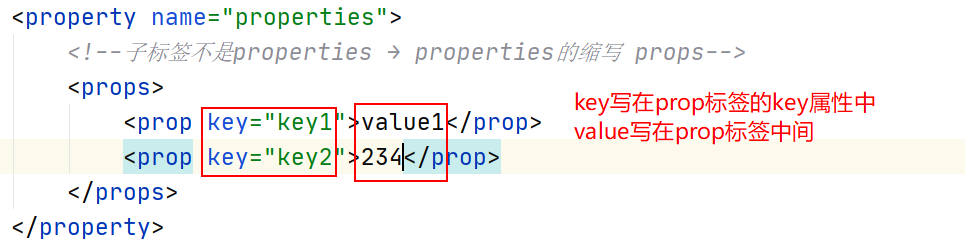
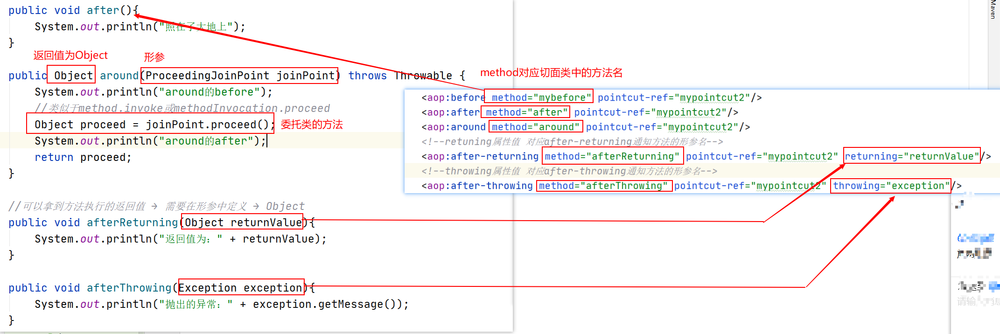

# 三、Spring

## 目录

## 1、SpringIOC&DI

### 1.1概念

Spring框架其实就是偏基础性的框架。可以去整合其他框架。类似于平台。

**IOC: Inverse of Controll 控制反转**

控制：实例的生成权

反转：由应用程序反转给spring

容器：容器是放置实例对象的地方

原先实例我们想用的时候自己new出来（主动的过程）；到了Spring阶段，把实例的生成权交给了Spring容器，由Spring容器进行生成并管理，当我们想用的时候就从容器中取出来。

**DI:Dependency Injection 依赖注入**

**依赖：**

​	谁依赖谁？ 小张依赖他对象 → 应用程序依赖Spring容器

​	为什么依赖？ 小张对象有钱 → Spring容器包含了应用程序必须的内容

**注入：**

​	谁注入谁？ Spring容器注入给应用程序

​	注入了什么？应用程序运行所必须的资源

**AOP：面向切面编程 Aspect oriented programming**

oop->object oriented programming


### 1.2特点

dependency injection, events, resources, i18n, validation, data binding, type conversion, SpEL, AOP

**依赖注入**、资源、i18n国际化（springmvc）、校验（Springmvc）、数据绑定、类型转换（springmvc）、SpringExpressionLanguage、**Aop（面向切面编程）**

### 1.3入门案例

#### 1.3.1Spring核心依赖5+1

spring-core、spring-context、spring-aop、spring-beans、spring-expression

commons-logging（jcl）


#### 1.3.2入门案例1

```java
public class HelloService {

    public void sayHello(String name){
        System.out.println("hello " + name);
    }
}
```

**创建Spring容器**

通过Spring配置文件来管理

xml的文件 → 通常名字叫application(-xx).xml

既然是xml文件，文件要满足一定的约束（schema）


**约束怎么来？**

1、 复制已有的配置文件的约束

2、 从spring的参考文档上的appendix上复制 

3、 通过创建文件模板来使用 （推荐）效率高


将组件交给Spring管理

```xml
<?xml version="1.0" encoding="UTF-8"?>
<beans xmlns="http://www.springframework.org/schema/beans"
       xmlns:xsi="http://www.w3.org/2001/XMLSchema-instance"
       xmlns:context="http://www.springframework.org/schema/context"
       xsi:schemaLocation="
        http://www.springframework.org/schema/beans https://www.springframework.org/schema/beans/spring-beans.xsd
        http://www.springframework.org/schema/context https://www.springframework.org/schema/context/spring-context.xsd">
    <!--组件注册-->
    <!--id:是组件在Spring容器中的唯一的标识-->
    <!--class:全类名-->
    <bean id="helloSerivce" class="com.cskaoyan.service.HelloService"/>

</beans>
```

ctrl+shift+alt+C取全类名

**从容器中取出组件进行使用**

```java
public class IocTest {

    @Test
    public void mytest1(){
        ApplicationContext applicationContext = new ClassPathXmlApplicationContext("application.xml");
        //从应用上下文中取出Spring容器中的组件
        HelloService helloSerivce = (HelloService) applicationContext.getBean("helloSerivce");
        helloSerivce.sayHello("ligenli");
    }
}
```

#### 1.3.3入门案例2

```java
public class HelloServiceImpl implements HelloService{

    HelloDao helloDao;

    @Override
    public void sayHello(String name) {
        helloDao.daoSayHello(name);
    }

    public String sayHello2(String name){
        return "hello " + name;
    }

    public HelloDao getHelloDao() {
        return helloDao;
    }

    public void setHelloDao(HelloDao helloDao) {
        this.helloDao = helloDao;
    }
}
```

```java
public class HelloDaoImpl implements HelloDao{
    @Override
    public void daoSayHello(String name) {
        System.out.println("hello " + name);
    }
}
```

在配置文件要维护组件之间的关系


使用：

```java
    @Test
    public void mytest(){
        ApplicationContext applicationContext = new ClassPathXmlApplicationContext("application.xml");
        //HelloServiceImpl bean = applicationContext.getBean(HelloServiceImpl.class);
        //spring建议通过接口的类型取出 → 比如给spring的组件增强 jdk动态代理
        HelloService helloService = applicationContext.getBean(HelloService.class);
        helloService.sayHello("songge");
    }
```

### 1.4ApplicationContext


都是去加载application

ClasspathXmlApplicationContext 加载classpath目录下的配置文件

FileSystemXmlApplicationContext 加载文件系统目录下的配置文件


#### 1.4.1BeanFactory


BeanFactory：容器中所有的组件都是通过这个Bean生产出来的

BeanFactory：生产所有组件bean

FactoryBean：XXXFactoryBean，factoryBean对应的特定的xxx实例

### 1.5XML文件中注册bean的方式

使用lombok

#### 1.5.1构造方法

###### 1.5.1.1无参构造

```xml
<!--无参构造要通过property标签调用set方法给成员变量赋值-->
<bean id="noArgsBean" class="com.cskaoyan.component.NoArgsConstructorBean">
   <!--id和name通过lombok的@Data注解提供了set方法；这两个参数是String和Integer
            可以使用value属性或者value标签-->
   <property name="id" value="1"/>
   <property name="name">
        <value>songge</value>
   </property>
</bean>
```

```java
/**
 * 无参构造方法
 * 默认包含无参的构造方法
 */
@Data
@NoArgsConstructor
public class NoArgsConstructorBean {
    String name;
    Integer id;
}
```


##### 1.5.1.2有参构造

```xml
<!--有参构造，要通过constructor-arg子标签来调用有参构造方法-->
<bean id="hasArgsBean" class="com.cskaoyan.component.HasArgsConstructorBean">
    <!--constructor-arg包含了name属性 对应有参构造方法的形参名-->
    <!--value属性和value子标签用法和property标签一致-->
    <constructor-arg name="id" value="2"/>
    <constructor-arg name="name" value="ligenli"/>
</bean>
```

```java
/**
 * 有参构造方法
 */
@AllArgsConstructor //写了有参构造方法，会将默认的无参构造方法覆盖掉
@Data
public class HasArgsConstructorBean {
    String name;
    Integer id;

    //public HasArgsConstructorBean(String name, Integer id) {
    //    this.name = name;
    //    this.id = id;
    //}
}
```


#### 1.5.2工厂

```java
public class Animal {
}
```

##### 1.5.2.1静态工厂

```java
/**
 * 静态工厂
 * 方法是静态的
 */
public class StaticFactory {

    public static Animal create(){
        return new Animal();
    }
}
```

```xml
    <!--静态工厂-->
    <!--factory-method对应的是静态工厂中的静态方法-->
    <bean id="animalFromStaticFactory" class="com.cskaoyan.factory.StaticFactory" factory-method="create"/>
```

##### 1.5.2.2实例工厂

```java
/**
 * 实例工厂
 * 方法不是静态的
 */
public class InstanceFactory {
    public Animal create(){
        return new Animal();
    }
}
```

```xml
    <!--实例工厂-->
    <bean id="instanceFactory" class="com.cskaoyan.factory.InstanceFactory"/>
    <bean id="animalFromInstanceFactory" factory-bean="instanceFactory" factory-method="create"/>
```


### 1.6生命周期(重要)

Spring中bean的生命周期

#### 1.6.1图解


#### 1.6.2代码

```java
public class LifeCycleBean implements BeanNameAware, BeanFactoryAware ,ApplicationContextAware,
        InitializingBean, DisposableBean {
    String name;
    public LifeCycleBean(){
        System.out.println("1、实例化");//可以重写无参构造方法，来查看这个组件是否注册
    }
    public void setName(String name) {
        this.name = name;
        System.out.println("2、set方法设置参数");
    }
    @Override
    public void setBeanName(String s) {
        System.out.println("3、BeanNameAware：" + s);
    }
    @Override
    public void setBeanFactory(BeanFactory beanFactory) throws BeansException {
        System.out.println("4、BeanFactoryAware");
    }
    @Override
    public void setApplicationContext(ApplicationContext applicationContext) throws BeansException {
        System.out.println("5、ApplicationContextAware");
    }
    @Override
    public void afterPropertiesSet() throws Exception {
        System.out.println("7、InitializingBean");
    }
    public void customInit(){ //要告诉spring这是自定的init方法
        System.out.println("8、customInit");
    }
    @Override
    public void destroy() throws Exception {
        System.out.println("10、DisposableBean的destroy");
    }
    public void customDestroy(){
        System.out.println("11、customDestroy");
    }
}
```

```java
/**
 * 如果注册在容器中，其他所有组件都会执行到这里
 * 自己不会执行
 */
public class CustomBeanPostProcessor implements BeanPostProcessor {
    //beanName就是组件id
    @Override
    public Object postProcessBeforeInitialization(Object bean, String beanName) throws BeansException {
        //传入了一个bean，然后返回了一个bean
        //可以在这里给bean增强 → 狸猫换太子 → 把bean换成增强bean（动态代理）
        System.out.println("6、BeanPostProcessor的before：" + beanName);
        return bean;
    }

    @Override
    public Object postProcessAfterInitialization(Object bean, String beanName) throws BeansException {
        System.out.println("9、BeanPostProcessor的after：" + beanName);

        return bean;
    }
}
```

```xml
<bean id="lifeCycleBean" class="com.cskaoyan.bean.LifeCycleBean" init-method="customInit" destroy-method="customDestroy">
   <property name="name" value="songge"/>
</bean>
<bean class="com.cskaoyan.bean.CustomBeanPostProcessor"/>
```

```java
//测试
@Test
public void mytest1(){
    ClassPathXmlApplicationContext applicationContext = new ClassPathXmlApplicationContext("application.xml");
    //不需要取出组件，生命周期就已经开始
    applicationContext.close();
}
```

### 1.7Scope

组件的作用域：singleton（单例）、prototype（原型）

singleton：容器中的组件 始终以单例的形式存在 → 默认是单例

prototype：每次从容器中取出组件都是一个新的组件 → 相当于每一次new一个新的


### 1.8CollectionBean(xml的spring配置)

要在组件中定义一些collection类型的成员变量 → 注入值

注册组件的时候，会遇到组件的成员变量类型为array、list、set等类型 → 这个成员变量在组件注册过程中怎么写 

→ 整合一些框架组件的时候会使用到 → class已经编译过

```java
@Data
public class CollectionBean {
    Object[] arrayParam;
    //String[] stringArray;
    //User[] users;
    List listParam;
    Set setParam;
    Map mapParam;
    Properties properties;
}
```


array、list、set只有property的子标签不同，其余的写法都是相同的


map和properties：

map需要key和value：key和value可以是字符串、基本类型、包装类、javabean

properties也需要key和value： key和value不能是javabean




### 1.9注解(非常重要！)

首先要**打开注解扫描开关**

```xml
<!--扫描范围是com.cskaoyan这个包及子包-->
<!--只要包目录包含base-package中的值就在扫描范围-->
<context:component-scan base-package="com.cskaoyan"/>
```

#### 1.9.1组件注册

@Component

特殊场景的使用

@Serivce → service层组件

@Repository → dao层组件

@Controller → 控制层组件（springmvc阶段才能使用）

**组件id：**

使用注解后组件id是什么：

可以指定id：@Component（“helloService”）使用注解的value属性指定id

可以使用默认id：如果没有指定id，那么使用的是默认id


#### 1.9.2注入类

给容器中的组件的成员变量赋值 → 或者维护组件之间的关系

##### 1.9.2.1字符串、基本类型、包装类(@Value)


如果：

value中的值不写死，引用properties配置文件中的key

 1、在spring配置文件中引入properties文件

2、在@value注解中引用key

```xml
<context:property-placeholder location="classpath:param.properties"/>
```


##### 1.9.2.2JavaBean

1、@Autowired → getBean(class) → 容器中这个类型的组件只有一个

2、@Autowired+@Qualifier → 容器中这个类型的组件不止一个，通过@Qualifier指定组件id

3、@Resource → 默认可以按照类型去取，也可以使用name属性指定组件id

###### 1.9.2.2.1类型组件只有一个


###### 1.9.2.2.2类型组件不止一个


#### 1.9.3scope

写在类上

singleton、prototype


#### 1.9.4生命周期

init-method

destroy-method

之前是写在bean标签中的属性


#### 1.9.5单元测试

之前单元测试都是先去获得ApplicationContext对象

 spring对单元测试有良好的支持

可以在单元测试类中直接使用注入类的注解从容器中取出组件

##### 1.9.5.1引入依赖


##### 1.9.5.2加载配置文件

在配置类上增加注解

@Runwith

@ContextConfiguration

```java
@RunWith(SpringJUnit4ClassRunner.class)
@ContextConfiguration("classpath:application.xml")
public class AnnotationTest {

    @Autowired
    UserService userService;

    @Test
    public void mytest(){
        userService.sayUser("songge");
    }
}
```

#### 1.9.6注意事项

注解要在组件中使用

不是说所有的类都要到spring容器中注册：一般是提供了某些方法的类要注册到容器中，或者提供了某些功能的类要注册到容器中

## 2、SpringAOP

### 2.1概念

给容器中的组件做增强

之前做增强：静态代理、动态代理

OOP：面向对象编程 → 继承、传入一个对象

AOP：面向切面编程


使用动态代理给一个类生成代理对象

aop是给容器中的组件批量生成代理对象 → 把要增强的方法放到一起 → 这个范围称为切面

### 2.2AOP编程术语


### 2.3AOP实战

#### 2.3.1动态代理(手动方式)

jdk动态代理，cglib动态代理

spring也提供了cglib动态代理的包


#### 2.3.2SpringAOP(半自动)

容器中注册组件 → 通过aop形式生成一个增强组件

通知

##### 2.3.2.1注册一个委托类target组件


##### 2.3.2.2通知(按照什么方式来增强)


##### 2.3.2.3Proxy增强组件


#### 2.3.3AspectJ(全自动)

aspect for java

 

批量增强：批量不是组件 → ***\*组件中的\****方法 → 要被增强的方法所在类要注册在容器中

Pointcut：切入点。来指定方法 → 粒度更精细

##### 2.3.3.1引入全新依赖

建议使用groupid带org的这个依赖


##### 2.3.3.2切入点表达式

批量的划分增强方法

execution（修饰符 返回值 包名.类名.方法名(形参)）

**能否省略？能否通配？有没有特殊用法？**

实例：

```java
//AOP
@Component
public class CustomAdvice implements MethodInterceptor {
    @Override
    public Object invoke(MethodInvocation methodInvocation) throws Throwable {
        System.out.println("正道的光");
        Object proceed = methodInvocation.proceed();
        System.out.println("照在了大地上");
        return proceed;
    }
}
```

```java
//bean
public class User {
}
```

```java
//service
@Component
public class HelloService {

    public void sayHello(String name){
        System.out.println("hello " + name);
    }

    public String returnString(){
        System.out.println("returnString");
        return "返回值为string";
    }
    public User returnUser(){
        System.out.println("returnUser");
        return new User();
    }

    public void sayGoodbye(String name){
        System.out.println("bye bye " + name);
    }

    //void com..service..login(*,*,Integer);
    public void login(String username,String password,Integer age){
        System.out.println("login by " + username);
    }
    public void login(String username,String password){
        System.out.println("login by " + username);
    }
    public void login(String username){
        System.out.println("login by " + username);
    }
    public void login(){
        System.out.println("login by " );
    }
    public void login(User user){
        System.out.println("login by " );
    }
    //有个问题想要对这三个login方法都划分到切入点表达式范围内 → 能否通配任意参数
}
```

**（修饰符 返回值 包名.类名.方法名(形参)）**

###### 2.3.3.2.1修饰符

private、public这些修饰符

可以省略不写：代表任意修饰符

```xml
<!--******修饰符******-->
<!--不写修饰符 代表任意的修饰符都可以-->
<aop:pointcut id="mypointcut2" expression="execution(void com.cskaoyan.service.HelloService.sayHello(String))"/>

<aop:advisor advice-ref="customAdvice" pointcut-ref="mypointcut2"/>
```

###### 2.3.3.2.2返回值

能否省略：不能省略

能否通配：可以使用*来通配

特殊用法：如果返回值是javabean则需要写全类名；如果是基本类型或java.lang包目录下的可以直接写

```xml
 <!--******返回值******-->
        <!--*通配任意返回值-->
        <aop:pointcut id="mypointcut3" expression="execution(* com.cskaoyan.service.HelloService.sayHello(String))"/>
        <!--如果返回值是javabean则需要写全类名；如果是基本类型或java.lang包目录下的可以直接写-->
        <aop:pointcut id="mypointcut4" expression="execution(String com.cskaoyan.service.HelloService.returnString())"/>
<!--这个是错误的-->
        <aop:pointcut id="mypointcut5" expression="execution(com.cskaoyan.bean.User com.cskaoyan.service.HelloService.returnUser())"/>
```

###### 2.3.3.2.3包名+类名+方法名

能否省略：可以***\*部分省略\****。→ 除了头和尾不能省略，中间的部分都可以省略，通过..来省略中间的部分

能否通配：可以通配*。头中间尾都可以使用*来通配。*可以代表一个单词或一个单词的一部分

```xml
<!-- ******包名类名方法名******-->
        <!--除了头和尾不能省略，中间的部分都可以省略 → 中间使用..来进行省略-->
        <aop:pointcut id="mypointcut6" expression="execution(com.cskaoyan.bean.User com..returnUser())"/>
        <!--中间的任意一部分都可以省略-->
        <aop:pointcut id="mypointcut7" expression="execution(com.cskaoyan.bean.User com.cskaoyan.service..returnUser())"/>
        <!--任意一个地方都可以使用*来通配-->
        <aop:pointcut id="mypointcut8" expression="execution(* *.cskao*.service..return*())"/>
```

###### 2.3.3.2.4形参

能否省略：可以省略不写 → 无参方法

能否通配：*来通配 通配的单个返回值

特殊用法：返回值类似 如果参数是javabean，则要写全类名；如果是java.lang包目录下可以直接

```xml
<!--******形参******-->
        <!--能否省略：省略代表无参方法 参考mypoincut8-->
        <!--能否通配：*来通配 通配的单个返回值-->
        <aop:pointcut id="mypointcut9" expression="execution(* *.cskao*.service..login(*,String,Integer))"/>
        <!--使用..来通配任意数量的任意类型的参数-->
        <aop:pointcut id="mypointcut10" expression="execution(* *.cskao*.service..login(..))"/>
        <!--特殊点：返回值类似 如果参数是javabean，则要写全类名；如果是java.lang包目录下可以直接-->
        <aop:pointcut id="mypointcut11" expression="execution(* *.cskao*.service..login(com.cskaoyan.bean.User))"/>
```

最后：别忘了绑定通知

```xml
<aop:advisor advice-ref="customAdvice" pointcut-ref="mypointcut2"/>
```

##### 2.3.3.3advisor(通知自己定义)

引用pointcut和通知

###### 2.3.3.2.1通知组件

使用springaop是一样的，同样要实现MethodInterceptor接口，并且注册在容器中


###### 2.3.3.2.2aspectj中的advisor的配置

<aop → 引入aop的约束

1、复制已有的

2、官网appendix

3、创建模板

4、**自己改造**

 

**<aop:config>**

**<aop:poincut id expression**

**<aop:advisor advice-ref pointcut(-ref)** 

##### 2.3.3.4aspect(提供现有通知)

定义切入点和通知


##### 2.3.3.5aspect(提供通知)

定义pointcut和通知

时间：相对于委托类方法 → 基线


###### 2.3.3.5.1切面类

通知的方法 → 做什么事情 → 把该方法配置为对应的通知

```java
@Component
public class CustomAspect {
}
```

```xml
<aop:pointcut id="mypointcut1" expression="execution(* com.cskaoyan.service..*(..))"/>
引入新标签
<aop:aspect ref="customAspect">//类名首字母小写为组件id
</aop:aspect>
```

实例：

```java
@Component
public class CustomAspect {
public void mybefore(){
        System.out.println("正道的光");
    }
}
```

```xml
<aop:pointcut id="mypointcut1" expression="execution(* com.cskaoyan.service..*(..))"/>
<aop:aspect ref="customAspect">
<aop:before method="mybefore" pointcut-ref="mypointcut1"/>//引用签名定义的切入点表达式
</aop:aspect>
```

***1)JointPoint***


***2)通知的使用***



发生异常之后的执行


**没有around通知的后半部分！！！**

###### 2.3.3.5.2通过注解来使用aspect

***1）第一步开启开关***

```xml
<!--aspectj注解开关-->
<aop:aspectj-autoproxy/>
```

***2)切面中使用注解***

```java
//service
@Service
public class HelloService {

    public void sayHello(){
        System.out.println("hello songge");
    }
    public String sayHello(String name){
        String x = "hello " + name;
        System.out.println(x);
        return x;
    }
    public String createException(String name){
        String x = "create excetion";
        System.out.println(x);
        int i = 1/0;
        return x;
    }
}
```

```java
@Component
@Aspect
public class CustomAspect {
    //切入点
    @Pointcut("execution(* com.cskaoyan.service..*(..))")
    public void mypointcut(){}
    
    //@Before、@After、@Around、@AfterReturning、@AfterThrowing注解的value中
    // 写切入点表达式或引用@Pointcut注解对应的方法 → 注意引用的方式后面有一对括号
    @Before("execution(* com.cskaoyan.service..*(..))")
    //@Before("mypointcut()")
    public void mybefore(JoinPoint joinPoint){
        System.out.println("正道的光");
    }
    @After("mypointcut()")
    public void after(){
        System.out.println("照在了大地上");
    }
    @Around("mypointcut()")
    public Object around(ProceedingJoinPoint joinPoint) throws Throwable {
        System.out.println("around的before");
        Object proceed = joinPoint.proceed();
        System.out.println("around的after");
        return proceed;
    }

    @AfterReturning(value = "mypointcut()",returning = "returnValue")
    //可以拿到方法执行的返回值 → 需要在形参中定义 → Object
    public void afterReturning(Object returnValue){
        System.out.println("返回值为：" + returnValue);
    }
    @AfterThrowing(value = "mypointcut()",throwing = "exception")
    public void afterThrowing(Exception exception){
        System.out.println("抛出的异常：" + exception.getMessage());
    }
}
```

###### 2.3.3.5.3使用自定义注解来指定增强方法

@CountTime注解 → 加在方法 → 计算该方法的执行时间

```JAVA
@Target(ElementType.METHOD) //注解能够写在方法上
@Retention(RetentionPolicy.RUNTIME) //注解在运行时生效
public @interface CountTime {
}
```

```JAVA
@Component
@Aspect
public class CountTimeAspect {

    @Pointcut("@annotation(com.cskaoyan.anno.CountTime)")
    public void countTimePointcut(){}

    @Around("countTimePointcut()")
    public Object countTime(ProceedingJoinPoint joinPoint) throws Throwable {
        long start = System.currentTimeMillis();
        Object proceed = joinPoint.proceed();
        long end = System.currentTimeMillis();
        System.out.println(joinPoint.getSignature().getName() + "执行的时间是：" + (end - start));
        return proceed;
    }
}
```

```JAVA
@Service
public class HelloService {

    @CountTime
    public void sayHello(int second) throws InterruptedException {
        System.out.println("hello songge");
        Thread.sleep(second * 1000);
    }

    public void sayHello(){
        System.out.println("hello songge");
    }
}
```

```JAVA
//测试
@Test
public void mytest1() throws InterruptedException {
helloService.sayHello(3);
}
```


## 3、JDBCTemplate

主要是spring提供的一个jdbc的框架 简单 → 代码中写sql → 灵活

主要是看使用spring如何整合其他框架→ 通过spring注册其他框架的组件

### 3.1SE代码

#### 3.1.1引入依赖

```xml
<dependencies>
        <dependency>
            <groupId>org.springframework</groupId>
            <artifactId>spring-jdbc</artifactId>
            <version>5.2.6.RELEASE</version>
        </dependency>
        <!--5.7的mysql 驱动 5.1.47-->
        <dependency>
            <groupId>mysql</groupId>
            <artifactId>mysql-connector-java</artifactId>
            <version>5.1.47</version>
        </dependency>
        <dependency>
            <groupId>com.alibaba</groupId>
            <artifactId>druid</artifactId>
            <version>1.1.22</version>
        </dependency>
    </dependencies>
```

#### 3.1.2se代码

```java
public interface AccountService {

    boolean transfer(Integer fromId,Integer destId,Integer money);
}
```

```java
@Service
public class AccountServiceImpl implements AccountService{
    @Autowired
    AccountDao accountDao;
    @Override
    public boolean transfer(Integer fromId, Integer destId, Integer money) {
        Integer fromMoney = accountDao.selectMoneyById(fromId);
        Integer destMoney = accountDao.selectMoneyById(destId);
        fromMoney -= money;//转出人的钱变少了
        destMoney += money;//转入人的钱变多了

        accountDao.updateMoneyById(fromMoney, fromId);
        accountDao.updateMoneyById(destMoney, destId);

        return true;
    }
}
```

```java
public interface AccountDao {

    Integer selectMoneyById(Integer id);

    Integer updateMoneyById(Integer money,Integer id);
}
```

```java
@Repository
public class AccountDaoImpl implements AccountDao{

    @Autowired
    JdbcTemplate jdbcTemplate;
    @Override
    public Integer selectMoneyById(Integer id) {
        String sql = "select money from j22_account_t where id = ?";
        Integer money = jdbcTemplate.queryForObject(sql, Integer.class, id);
        return money;
    }

    @Override
    public Integer updateMoneyById(Integer money, Integer id) {
        String sql = "update j22_account_t set money = ? where id = ?";
        int update = jdbcTemplate.update(sql, money, id);
        return update;
    }
}
```

```xml
转义字符：

&出现问题了 → xml文件中 → 转义字符

&：&amp；

空格：&nbsp；

>:&gt;->greater than
<:&lt;->less than
```

```
//JDBCTemplateTest
@RunWith(SpringJUnit4ClassRunner.class)
@ContextConfiguration("classpath:application.xml")
public class JdbcTemplateTest {

    @Autowired
    AccountService accountService;

    @Test
    public void mytest(){
        accountService.transfer(1,2,100);
    }
}
```

```java
//SE test
    @Test
    public void mytest(){
        DruidDataSource dataSource = new DruidDataSource();
        dataSource.setDriverClassName("com.mysql.jdbc.Driver");
        dataSource.setUrl("jdbc:mysql://localhost:3306/j22_db?useUnicode=true&characterEncoding=utf-8");
        dataSource.setUsername("root");
        dataSource.setPassword("123456");
        JdbcTemplate jdbcTemplate = new JdbcTemplate();
        jdbcTemplate.setDataSource(dataSource);//依赖数据源

        //jdbcTemplate 的api
        //根据id查询username
        String sql = "select username from j22_user_t where id = ?";
        String username = jdbcTemplate.queryForObject(sql, String.class, 1);
        System.out.println("id为1的username：" + username);

    }
```


### 3.2Spring整合

使用注解来注册组件：可否使用@Component注解来注册组件 → 自己写的类

Datasource和JdbcTemplate不是我们自己写的 → 已经完成编译了 → 用bean

#### 3.2.1引入依赖

```xml
<dependency>
    <groupId>org.springframework</groupId>
    <artifactId>spring-context</artifactId>
    <version>5.2.6.RELEASE</version>
</dependency>
<dependency>
    <groupId>org.springframework</groupId>
    <artifactId>spring-test</artifactId>
    <version>5.2.6.RELEASE</version>
    <scope>test</scope>
</dependency>
```

#### 3.2.2配置文件

```
    <!--datasource-->
    <bean id="dataSource" class="com.alibaba.druid.pool.DruidDataSource">
        <property name="driverClassName" value="com.mysql.jdbc.Driver"/>
        <property name="url" value="jdbc:mysql://localhost:3306/j22_db?useUnicode=true&amp;characterEncoding=utf-8"/>
        <property name="username" value="root"/>
        <property name="password" value="123456"/>
    </bean>
    <!--jdbcTemplate-->
    <bean class="org.springframework.jdbc.core.JdbcTemplate">
        <property name="dataSource" ref="dataSource"/>
    </bean>
```

#### 3.2.3@Autowired注解的另一个使用方式

注解放在方法上：在组件初始化的时候，会执行到该方法

```java
@Repository
public class AccountDaoImpl implements AccountDao{

    JdbcTemplate jdbcTemplate;
    @Autowired
    public void testAutowired(){ //组件初始化的时候会执行到
        System.out.println("testAutowired");
    }
    @Autowired
    public void setJdbcTemplate(@Qualifier("jdbcTemplate") JdbcTemplate jdbcTemplate) {
        //如果容器中该类型组件不止一个，可@Qualifier指定组件id
        this.jdbcTemplate = jdbcTemplate;
    }

    @Override
    public Integer selectMoneyById(Integer id) {
        String sql = "select money from j22_account_t where id = ?";
        Integer money = jdbcTemplate.queryForObject(sql, Integer.class, id);
        return money;
    }

    @Override
    public Integer updateMoneyById(Integer money, Integer id) {
        String sql = "update j22_account_t set money = ? where id = ?";
        int update = jdbcTemplate.update(sql, money, id);
        return update;
    }
```

#### 3.2.4JDBCDaoSupport


## 4、SpringTX

事务并发引起的问题：

脏读：一个事务读取到另一个事务**还未提交**的数据

不可重复读：一个事务读到另外一个事务 **已经的提交的** 数据

幻读（虚读）：一个事务读到另外一个事务 **已经的提交的** 数据

### 4.1Spring事务

#### 4.1.1核心概念


##### 4.1.1.1PlatFormTransactionManager

平台事务管理器

##### 4.1.1.2TransactionStatus

事务的状态

##### 4.1.1.3TransactionDefinition

事务定义

###### 4.1.1.3.1传播行为Progagation

多个事务操作如何共享事务 → 包含事务的方法之间产生互相调用

```java
class ServiceA{
void methodA(){
}
}

class ServiceB{
void methodB(){
serviceA.methodA()
}
}
```

最常用的是

**Required**：把多个事务看成是同一个事务来操作 → 一荣俱荣一损俱损 → 要么一起提交事务，要么一起回滚


**requires_new:**总是发起一个新的事务，methodA作为一个单独的新事务。

自私的人，他出错了他影响别人，但是别人出错了，他不管别人。→ 外围不影响里面，里面影响外围

如果methodB发生异常，methodA是否回滚？B回滚A不回滚

如果methodA发生异常methodB是否回滚？AB都回滚


**nested**：以嵌套事务的方式运行。

无私的人：里面发生的错误不会影响外围，外围发生的错误会影响里面

集体个人：如果集体没了，个人安身立命的场所也没了。如果个人没了，对集体没有影响。

如果methodB发生异常，methodA是否回滚？A、B都回滚

如果methodA发生异常methodB是否回滚？A回滚

用户注册 → 发放优惠券（nested）

如果发放优惠券的时候发生错误，用户注册没有问题。→ 只想让发放优惠券回滚，用户注册留下

#### 4.1.2Spring事务案例

核心**DataSourceTransactionManager**

所有案例均需要

```xml
    <!--TransactionManager-->
<bean id="transactionManager" class="org.springframework.jdbc.datasource.DataSourceTransactionManager">
    <property name="dataSource" ref="dataSource"/>
</bean>
```

##### 4.1.2.1TransactionTemplate(手动实现事务)

组件 → TransactionManager → datasource

```xml
    <!--datasource-->
    <bean id="dataSource" class="com.alibaba.druid.pool.DruidDataSource">
        <property name="driverClassName" value="com.mysql.jdbc.Driver"/>
        <property name="url" value="jdbc:mysql://localhost:3306/j22_db?useUnicode=true&amp;characterEncoding=utf-8"/>
        <property name="username" value="root"/>
        <property name="password" value="123456"/>
    </bean>
    <!--TransactionManager-->
    <bean id="transactionManager" class="org.springframework.jdbc.datasource.DataSourceTransactionManager">
        <property name="dataSource" ref="dataSource"/>
    </bean>

    <!--TransactionTemplate-->
    <bean class="org.springframework.transaction.support.TransactionTemplate">
        <property name="transactionManager" ref="transactionManager"/>
    </bean>
```

```java
@Repository
public class AccountDaoImpl extends JdbcDaoSupport implements AccountDao {

    @Autowired
    public void setJdbcDatasource(DataSource datasource){
        setDataSource(datasource);
    }

    @Override
    public Integer selectMoneyById(Integer id) {
        String sql = "select money from j22_account_t where id = ?";
        JdbcTemplate jdbcTemplate = getJdbcTemplate();
        Integer money = jdbcTemplate.queryForObject(sql, Integer.class, id);
        return money;
    }

    @Override
    public Integer updateMoneyById(Integer money, Integer id) {
        String sql = "update j22_account_t set money = ? where id = ?";
        int update = getJdbcTemplate().update(sql, money, id);
        return update;
    }
}
```

有返回值，返回值<Integer>类型


无返回值，用下面这种方法


##### 4.1.2.2事务代理对象

类似springaop

通过委托类组件生成代理组件

```xml
<!--datasource-->
    <bean id="dataSource" class="com.alibaba.druid.pool.DruidDataSource">
        <property name="driverClassName" value="com.mysql.jdbc.Driver"/>
        <property name="url" value="jdbc:mysql://localhost:3306/j22_db?useUnicode=true&amp;characterEncoding=utf-8"/>
        <property name="username" value="root"/>
        <property name="password" value="123456"/>
    </bean>
    <!--TransactionManager-->
    <bean id="transactionManager" class="org.springframework.jdbc.datasource.DataSourceTransactionManager">
        <property name="dataSource" ref="dataSource"/>
    </bean>

    <bean id="accountServiceProxy" class="org.springframework.transaction.interceptor.TransactionProxyFactoryBean">
        <!--target 要去增强的组件-->
        <property name="target" ref="accountServiceImpl"/>
        <!--transactionManager-->
        <property name="transactionManager" ref="transactionManager"/>
        <!--transactionAttributes → definition-->
        <!--参数类型是properties类型，可以使用我们学过的collectionBean-->
        <property name="transactionAttributes">
            <props>
                <!--key是方法名 value就是事务的定义-->
                <!--
                    传播行为：PROPAGATION_xxx
                    隔离级别：ISOLATION_xxx REPEATABLE_READ、DEFAULT
                    只读：readonly
                    超时：timeout_数字 单位是秒
                    rollbackFor：-XXXException
                    noRollbackFor：+XXXException
                -->
                <prop key="transfer">PROPAGATION_REQUIRED,ISOLATION_DEFAULT</prop>
            </props>
        </property>
    </bean>
```

```java
@Service
public class AccountServiceImpl implements AccountService{
    @Autowired
    AccountDao accountDao;

    @Override
    public boolean transfer(Integer fromId, Integer destId, Integer money) {
        Integer fromMoney = accountDao.selectMoneyById(fromId);
        Integer destMoney = accountDao.selectMoneyById(destId);
        fromMoney -= money;//转出人的钱变少了
        destMoney += money;//转入人的钱变多了
        Integer update1 = accountDao.updateMoneyById(fromMoney, fromId);
        int i = 1/0;
        Integer update2 = accountDao.updateMoneyById(destMoney, destId);
        return true;
    }

}
```

##### 4.1.2.3事务通知

aspectj的advisor

```xml
<dependency>
            <groupId>org.aspectj</groupId>
            <artifactId>aspectjweaver</artifactId>
            <version>1.9.5</version>
</dependency>
```


```xml
<!--datasource-->
    <bean id="dataSource" class="com.alibaba.druid.pool.DruidDataSource">
        <property name="driverClassName" value="com.mysql.jdbc.Driver"/>
        <property name="url" value="jdbc:mysql://localhost:3306/j22_db?useUnicode=true&amp;characterEncoding=utf-8"/>
        <property name="username" value="root"/>
        <property name="password" value="123456"/>
    </bean>
```


##### 4.1.2.4声明式事务->注解(最简单，最方便，最好用，最重要)

注解写在哪里，哪里就增加事务

**首先要打开注解开关：**

```xml
<tx:annotation-driven transaction-manager="transactionManager"/>
```

```xml
<!--datasource-->
    <bean id="dataSource" class="com.alibaba.druid.pool.DruidDataSource">
        <property name="driverClassName" value="com.mysql.jdbc.Driver"/>
        <property name="url" value="jdbc:mysql://localhost:3306/j22_db?useUnicode=true&amp;characterEncoding=utf-8"/>
        <property name="username" value="root"/>
        <property name="password" value="123456"/>
    </bean>
    <!--TransactionManager-->
    <bean id="transactionManager" class="org.springframework.jdbc.datasource.DataSourceTransactionManager">
        <property name="dataSource" ref="dataSource"/>
    </bean>

    <tx:annotation-driven transaction-manager="transactionManager"/>
    
	<aop:aspectj-autoproxy/>
	//properties类型
    <context:property-placeholder location="classpath:param.properties"/>
```

使用注解：

@Transactional

加在类名上面就是当前类下所有方法都增加对应事务

在方法上添加则仅这个方法

definition写在注解属性中：

timeout，readonly，rollbackFor，norollbackFor

```java
@Transactional
@Service
public class AccountServiceImpl implements AccountService{
    @Autowired
    AccountDao accountDao;

    @Transactional(propagation = Propagation.REQUIRED,isolation = Isolation.DEFAULT)
    @Override
    public boolean transfer(Integer fromId, Integer destId, Integer money) {
        Integer fromMoney = accountDao.selectMoneyById(fromId);
        Integer destMoney = accountDao.selectMoneyById(destId);
        fromMoney -= money;//转出人的钱变少了
        destMoney += money;//转入人的钱变多了
        Integer update1 = accountDao.updateMoneyById(fromMoney, fromId);
        int i = 1/0;
        Integer update2 = accountDao.updateMoneyById(destMoney, destId);
        return true;
    }

}
```

## 5、Javaconfig

Spring组件的配置

之前的spring配置文件是xml，后续主流技术 springboot → 推荐大家使用javaconfig注册组件


配置类 class → 注册组件

<bean id class

### 5.1配置类


使用配置类的方法来注册组件

```java
@Configuration
public class ApplicationConfiguration {}
```

### 5.2@Bean

所有的bean标签都可以@Bean注解的形式

是否意味着所有的组件都使用@Bean注解注册呢？？ No，ioc阶段组件注册功能的注解依然去使用@Component@Service等；

xml也可以去使用；→很多网络的参考资料是xml的 → 具备xml转换为javaconfig的能力


### 5.3其他标签


都是写在配置类上


<aop:config 还不能javaconfig

### 5.4如何单元测试


#### 在使用idea过程中经常会遇到的一个问题

idea的bug

你复制文件进到idea中，有的时候没有编译 → FileNotFoundException

怎么办？

1、target下的classes删除掉，重新运行

2、build下rebuild你的project

3、手动编译进去 → 就是复制文件到target下的classes中

####  ctrl+f12

查找当前类方法的快捷键

