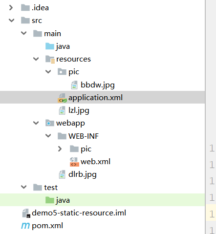
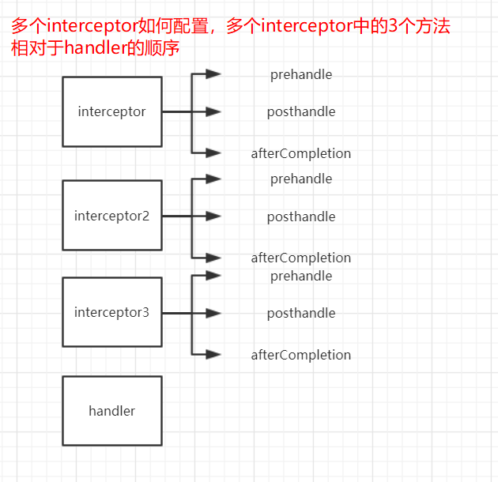
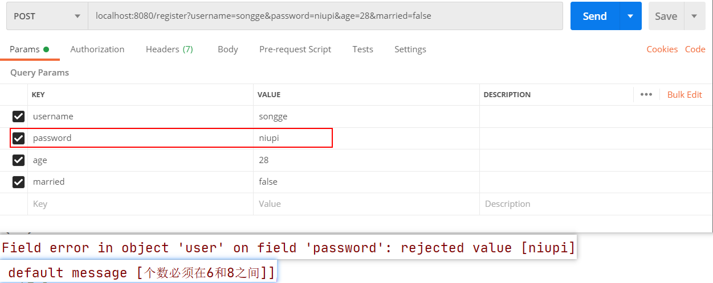

# 四、SpringMVC

## 目录

## 1、springmvc

### 1.1入门案例1

核心DispatcherServlet如何配置

**HandlerMapping**

**HandlerAdapter**

**Handler**

application.xml → DispatcherServlet启动的时候加载这个配置文件

#### 1.1.1引入依赖

SpringMVC：spring-web、spring-webmvc、servlet-api（provided）

```xml
<dependencies>
        <dependency>
            <groupId>org.springframework</groupId>
            <artifactId>spring-webmvc</artifactId>
            <version>5.2.6.RELEASE</version>
        </dependency>
        <dependency>
            <groupId>javax.servlet</groupId>
            <artifactId>servlet-api</artifactId>
            <version>3.0-alpha-1</version>
            <scope>provided</scope>
        </dependency>
    </dependencies>
```

#### 1.1.2配置成idea中的标准web应用


#### 1.1.3配置DispatcherServlet

#### 1.1.4加载xml配置文件

web.xml里面

```xml
<?xml version="1.0" encoding="UTF-8"?>
<web-app xmlns="http://xmlns.jcp.org/xml/ns/javaee"
         xmlns:xsi="http://www.w3.org/2001/XMLSchema-instance"
         xsi:schemaLocation="http://xmlns.jcp.org/xml/ns/javaee http://xmlns.jcp.org/xml/ns/javaee/web-app_4_0.xsd"
         version="4.0">
    
    <!--注册DispatcherServlet-->
    <servlet>
        <servlet-name>dispatcherServlet</servlet-name>
        <!--dispatcherServlet的全类名-->
        <servlet-class>org.springframework.web.servlet.DispatcherServlet</servlet-class>
        <init-param>
            <param-name>contextConfigLocation</param-name>
            <param-value>classpath:application.xml</param-value>
        </init-param>
    </servlet>
    <servlet-mapping>
        <servlet-name>dispatcherServlet</servlet-name>
        <url-pattern>/</url-pattern>
    </servlet-mapping>
</web-app>
```


#### 1.5注册组件


```xml
<?xml version="1.0" encoding="UTF-8"?>
<beans xmlns="http://www.springframework.org/schema/beans"
       xmlns:xsi="http://www.w3.org/2001/XMLSchema-instance"
       xmlns:context="http://www.springframework.org/schema/context"
       xmlns:aop="http://www.springframework.org/schema/aop"
       xsi:schemaLocation="
        http://www.springframework.org/schema/beans https://www.springframework.org/schema/beans/spring-beans.xsd
        http://www.springframework.org/schema/context https://www.springframework.org/schema/context/spring-context.xsd
        http://www.springframework.org/schema/aop https://www.springframework.org/schema/aop/spring-aop.xsd">
    <context:component-scan base-package="com.cskaoyan"/>
    <!--HandlerMapping-->
    <!--通过handler组件的id和请求url建立映射关系-->
    <bean class="org.springframework.web.servlet.handler.BeanNameUrlHandlerMapping"/>
    <!--HandlerAdapter-->
    <!--适配的是SimpleController类型的Handler-->
    <bean class="org.springframework.web.servlet.mvc.SimpleControllerHandlerAdapter"/>
    <!--Handler → 组件-->
    <!--我们通过@Component注解来注册了-->


</beans>
```

### 1.2 入门案例2

依然要配置成SpringMVC的web应用

依然要去注册组件HandlerMapping、HandlerAdapter

**handler相关的组件发生了变化 → handler以方法的形式存在 → handler方法仍然是要和请求url建立映射关系**

#### 1.2.1搭建成一个Springmvc的web应用

同上

#### 1.2.2配置SpringMVC容器中的组件

RequestMapping

RequestMappingHandlerMapping

RequestMappingHandlerAdapter

不用去写bean标签注册

```xml
<?xml version="1.0" encoding="UTF-8"?>
<beans xmlns="http://www.springframework.org/schema/beans"
       xmlns:xsi="http://www.w3.org/2001/XMLSchema-instance"
       xmlns:context="http://www.springframework.org/schema/context"
       xmlns:aop="http://www.springframework.org/schema/aop"
       xmlns:mvc="http://www.springframework.org/schema/mvc"
       xsi:schemaLocation="
        http://www.springframework.org/schema/beans https://www.springframework.org/schema/beans/spring-beans.xsd
        http://www.springframework.org/schema/context https://www.springframework.org/schema/context/spring-context.xsd
        http://www.springframework.org/schema/mvc https://www.springframework.org/schema/mvc/spring-mvc.xsd
        http://www.springframework.org/schema/aop https://www.springframework.org/schema/aop/spring-aop.xsd">
    <context:component-scan base-package="com.cskaoyan"/>
    <mvc:annotation-driven/>


</beans>
```

```xml
<servlet>
        <servlet-name>dispatcherServlet</servlet-name>
        <servlet-class>org.springframework.web.servlet.DispatcherServlet</servlet-class>
        <init-param>
            <param-name>contextConfigLocation</param-name>
            <param-value>classpath:application.xml</param-value>
        </init-param>
    </servlet>
    <servlet-mapping>
        <servlet-name>dispatcherServlet</servlet-name>
        <url-pattern>/</url-pattern>
    </servlet-mapping>
```

#### 1.2.3注册controller组件

handler方法在controller组件中存在 

业务：访问/hello → songge niupi ligenli daqi

 

handler方法中返回的ModelAndView → viewName:hello.jsp → content：ligenli daqi

```java
    @RequestMapping("hello")
    public ModelAndView hello(){
        ModelAndView modelAndView = new ModelAndView();
        //写相对于webapp的视图名
        modelAndView.setViewName("/WEB-INF/view/hello.jsp");
        //增加model当中的key
        modelAndView.addObject("content","ligenli daqi");
        return modelAndView;
    }
```


### 1.3围绕handler展开

#### 1.3.1@RequestMapping注解

##### 1.3.1.1url路径映射(最常用)

就是通过@RequestMapping注解的value属性将handler方法和请求url建立映射关系

入门案例2其实已经做过这样的事情了

###### 1.3.1.1.1将多个url映射到同一个handle方法上

###### 1.3.1.1.2可以使用*来通配

```java
@Controller
public class UrlMappingController {


    //将多个url映射到同一个handler方法上
    @RequestMapping(value = {"hello","hello2","hello3"})
    public ModelAndView hello(){
        ModelAndView modelAndView = new ModelAndView();
        modelAndView.setViewName("/WEB-INF/view/hello.jsp");
        return modelAndView;
    }

    //使用*来通配一个单词或一部分
    @RequestMapping({"ligenli*","ligenli/*"})
    public ModelAndView ligenli(){
        ModelAndView modelAndView = new ModelAndView();
        modelAndView.setViewName("/WEB-INF/view/ligenli.jsp");
        return modelAndView;
    }
}
```

#### 1.3.2窄化请求映射

比如 user相关的请求（handler方法），都放在UserController这个组件中

对应的请求url都是和user相关的

user/insert

user/delete

user/update

都是写在handler方法的@RequestMapping注解的value中，能否把user提取出来

insert

delete

update

```java
@Controller
@RequestMapping("user")
public class UserController {

    @RequestMapping("insert")
    public ModelAndView insert(){
        ModelAndView modelAndView = new ModelAndView();
        modelAndView.setViewName("/WEB-INF/view/user.jsp");
        modelAndView.addObject("operation","insert");
        return modelAndView;
    }
    @RequestMapping("delete")
    public ModelAndView delete(){
        ModelAndView modelAndView = new ModelAndView();
        modelAndView.setViewName("/WEB-INF/view/user.jsp");
        modelAndView.addObject("operation","delete");
        return modelAndView;
    }

    @RequestMapping("update")
    public ModelAndView update(){
        ModelAndView modelAndView = new ModelAndView();
        modelAndView.setViewName("/WEB-INF/view/user.jsp");
        modelAndView.addObject("operation","update");
        return modelAndView;
    }
}
```

#### 1.3.3请求方法限定（405）

RequestMethod → get post 

 

在@RequestMapping注解这个增加method属性


##### 1.3.3.1请求方法与限定方法不一致


```
@Controller
@RequestMapping("method")
public class RequestMethodController {

    //@RequestMapping(value = "get",method = RequestMethod.GET)
    @GetMapping("get")
    public ModelAndView methodGet(){
        System.out.println("get请求");
        ModelAndView modelAndView = new ModelAndView();
        modelAndView.setViewName("/WEB-INF/view/method.jsp");
        return modelAndView;
    }
    //@RequestMapping(value = "post",method = RequestMethod.POST)
    @PostMapping("post")
    public ModelAndView methodPost(){
        System.out.println("post请求");
        ModelAndView modelAndView = new ModelAndView();
        modelAndView.setViewName("/WEB-INF/view/method.jsp");
        return modelAndView;
    }

    /**
     * 多个请求方法之间的关系是什么 or还是and → or
     */
    @RequestMapping(value = "multi",method = {RequestMethod.POST,RequestMethod.GET})
    public ModelAndView methodMulti(){
        System.out.println("multi请求");
        ModelAndView modelAndView = new ModelAndView();
        modelAndView.setViewName("/WEB-INF/view/method.jsp");
        return modelAndView;
    }
}
```

@GetMapping → @RequestMapping（method=GET）

@PostMapping→ @RequestMapping（method=POST）

#### 1.3.4请求参数限定

仍然是在@RequestMapping的注解中写param属性


#### 1.3.5请求header限定

##### 1.3.5.1通用限定

@RequestMapping headers属性


特殊的限定

produces → Accept（406）


#####  **consumes → Content-Type（415）**


### 1.4handler的返回值

#### 1.4.1处理视图层

##### 1.4.1.1void

如何配置model参数，如何设置视图view

使用request和response


##### 1.4.1.2ModelAndView


##### 1.4.1.3String

返回这个字符串的含义是什么？

###### 1.4.1.3.1物理视图名

 → viewName

我们的model怎么办？ → model放入handler方法的形参


###### 1.4.1.3.2逻辑视图名

何为逻辑视图名

物理视图名中我们写了一个"/WEB-INF/view/string.jsp"这样的返回值，我们的返回值不想写这么多，只想写一个string，这时候可以使用逻辑视图名

需要去配置组件：viewResolver


配置了视图解析器 有何影响

**modelAndView中viewName会拼接**


**在上面物理视图名的案例中返回值也会受影响 → 也就是所有的返回值为字符串都会做一个拼接**


###### 1.4.1.3.3转发重定向

字符串来进行转发和重定向

转发和重定向的是**请求，而不是jsp**


#### 1.4.2不处理视图层(json)->非常重要

前后端分离，视图层的开发交给前端来做

返回值类型 可以写成Object → json数据

**依赖+@ResponseBody注解（@RestController）**

##### 1.4.2.1导包

jackson


##### 1.4.2.2handler方法上增加@ResponseBody


##### 1.4.2.3引申一个注解@RestController


### 1.5handler形参

请求参数的封装

#### 1.5.1通过表单协助我们构造请求


#### 1.5.2使用request封装形式（不推荐）

使用javaEE阶段的封装形式

request.getParameter(“key”);


#### 1.5.3自动封装

不通过request，需要什么参数就写什么参数

##### 1.5.3.1直接写在handler方法的形参上

String、基本类型、包装

String username，int age，Boolean married


##### 1.5.3.2封装为javabean

javabean的成员变量名 和请求参数名一致


##### 1.5.3.3多级javabean(嵌套javabean)


##### 1.5.3.4数组数据和list


##### 1.5.3.5SpringMVC不包括converter

converter：请求参数的类型转换

Date ：2020-07-21

###### 1.5.3.5.1首先写一个自定义converter

由String转化成形参中(或javabean成员变量)接受的数据类型


###### 1.5.3.5.2配置（稍微繁琐一点）


###### 1.5.3.5.3补充

若使用日期

SpringMVC不能够直接转换date，但是呢可以通过指定date日期的格式来转换


##### 1.5.3.6其他格式

######  1.5.3.6.1File

使用springmvc有没有什么方便的形式。

File可以直接在形参中接收

1)导包

commons-io、commons-fileupload

```java
<dependency>
            <groupId>commons-fileupload</groupId>
            <artifactId>commons-fileupload</artifactId>
            <version>1.4</version>
</dependency>
```


2)注册组件(multipartResolver)

```xml
    <!--id为指定值，不能修改为其他值-->
    <bean id="multipartResolver" class="org.springframework.web.multipart.commons.CommonsMultipartResolver">
    </bean>
```

3)构建一个文件上传的请求form

```java
<h1>文件上传</h1>
<form action="/file/upload" enctype="multipart/form-data" method="post">
    类型为file，name为请求参数名<br>
    <input type="file" name="myfile"><br>
    <input type="submit">
</form><hr>
```


4)接受文件的数组(批量上传)


###### 1.5.3.6.2cookie和session

(一)通过request来获得

1）cookie


2）session


（二）HttpSession直接写到形参中


###### 1.5.3.6.3Json数据作为形参

要在handler方法中接收json

1）导包

```xml
<dependency>
            <groupId>com.fasterxml.jackson.core</groupId>
            <artifactId>jackson-databind</artifactId>
            <version>2.11.0</version>
</dependency>
```

2)@RequestBody


3）通过map获得对象


###### 1.5.3.6.4Post请求乱码问题


### 1.6RestFul

Representational State Transfer

通过发送http请求 → 获得请求过程中的值作为请求参数

RestFul → 返回值为json → @ResponseBody 或 @RestController

#### 1.6.1@PathVariable(最常用)

拿到请求url中的一部分作为请求参数


测试


#### 1.6.2@RequestParam

拿到请求参数作为handler方法形参

login?username=songge&password=niu

login(String username,String password)


#### 1.6.3@RequestHeader

拿到请求头中的值作为请求参数


#### 1.6.4@CookieValue

联系上面cookie一起看

拿到对应cookie的值


#### 1.6.5@SessionAttribute

联系上面session一起看

拿到对应session的值


### 1.7静态资源处理


#### 1.7.1默认的servlet


#### 1.7.2默认的servlet对应的handler


```xml
<mvc:default-servlet-handler/>
```

#### 1.7.3静态资源映射(SpringMVC建议大家使用)

请求url和静态资源所处的路径建立映射映射

通过请求url可以访问到对应路径的静态资源

 

开发软件 最终是要部署到服务器  → 打包成war包 → 新增的图片和一些资源 放到文件路径

 

静态资源映射路径：

1、classpath（java\和resources → 打包后war里WEB-INF/classes）

2、web根路径（webapp → 打包后的根目录）

3、纯文件系统的映射




### 1.8异常处理

#### 1.8.1统一的异常处理器(ModelAndView)

发生了异常都进入到该处理中处理

注册组件:


#### 1.8.2通过异常类型的判断也可以处理不同的异常


```html
//jsp这么接收
<body>
    你完蛋了，发生异常了<br>
    ${message}
</body>
```


#### 1.8.3针对异常handler处理(推荐)

通过handler来处理指定异常 → ModelAndView和json都能处理 → 更精细的异常处理

 handler仍然是以方法的形式存在 → ControllerAdvice组件中


```java
public class CustomException extends Exception{
}
```

### 1.9handlerInterceptor

接口中提供了3个方法

prehandle

posthandle

afterCompletion


#### 1.9.1入门案例1

##### 1.9.1.1注册组件


##### 1.9.1.2在springmvc中配置文件

interceptor的顺序 → 该interceptor在执行链的什么位置


##### 1.9.1.3测试


##### 1.9.1.4prehandle返回值改为false


prehandle返回值为false执行到prehandle则中断流程，不能继续向下执行

但是执行prehandle为true的一定会执行afterhandle

##### 1.9.1.5posthandle方法中可以修改ModelAndView


若是返回值为json数据


#### 1.9.2interceptor的作用范围

默认是DispatcherServlet的作用范围/

能否修改interceptor的作用范围呢？


#### 1.9.3多个interceptor



##### 1.9.3.1注册组件

3个customInterceptor实现HandlerInterceptor

##### 1.9.3.2SpringMVC配置文件中配置interceptor


##### 1.9.3.3执行顺序


###### 1.9.3.3.1prehandle返回值均为true


###### 1.9.3.3.2prehandle的返回值为false

规律：

1、当prehandle返回值为true可以继续向下执行，并且它对应的执行过interceptor中的afterCompletion一定可以执行到

2、当prehandle返回值为false，不可继续向下执行。但是执行过的interceptor中的prehandle如果返回值为true，一定可以执行到的afterCompletion

### 1.10Locale处理

对于语言信息 → i18n国际化

#### 1.10.1注册一个组件localeResolver


#### 1.10.2使用


### 1.11MessageSource

国际化

做的事情，是通过key从配置文件中取出值，利用MessageSource组件

#### 1.11.1注册MessageSource组件


#### 1.11.2使用

通过key从配置文件中取出对应值


#### 1.11.3利用MessageSource和localeResolver来做i18n


##### 1.11.3.1注册组件


##### 1.11.3.2使用Locale


##### 1.11.3.3创建国际化的Message配置文件


#### 1.11.4使用国际化来获取message


getMessage


### 1.12Hibernate-Validator

参数校验

if(username .length > 6)

 

if(age > 100)

if(password != “niupi”)

 

将校验逻辑，绑定在javabean上，校验javabean的成员变量 → 作为handler方法的形参来使用

 

login（User user）

 register(User user) 

#### 1.12.1入门案例

##### 1.12.1.1导包

hibernate-validator


##### 1.12.1.2注册组件


##### 1.12.1.3使用

限定username和password 长度为6~8

限定age小于150

限定married为false


##### 1.12.1.4测试



#### 1.12.2拿到错误的参数去做个性化处理

需要拿到错误的参数

handler方法中增加一个参数bindingResult，拿到校验过程的结果


#### 1.12.3修改默认的message


#### 1.12.4message也可以做国际化

##### 1.12.4.1组件注册


##### 1.12.4.2使用MessageSource中的key


#### 1.12.5常用的注解


### 1.10Appendix

#### 1.6.1util标签

需要引入schema


### 1.6.2编码问题

```xml
<filter>
        <filter-name>characterEncodingFilter</filter-name>
        <filter-class>org.springframework.web.filter.CharacterEncodingFilter</filter-class>
        <init-param>
            <param-name>encoding</param-name>
            <param-value>UTF-8</param-value>
        </init-param>
        <init-param>
            <param-name>forceEncoding</param-name>
            <param-value>true</param-value>
        </init-param>
    </filter>
    <filter-mapping>
        <filter-name>characterEncodingFilter</filter-name>
        <url-pattern>/*</url-pattern>
    </filter-mapping>
```

