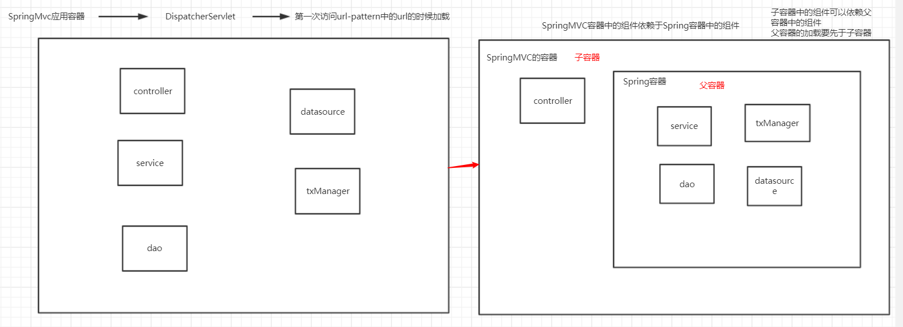
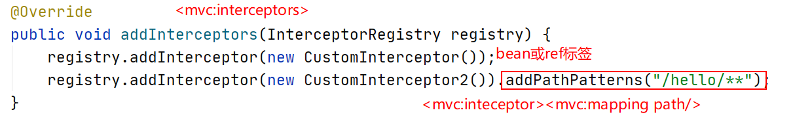
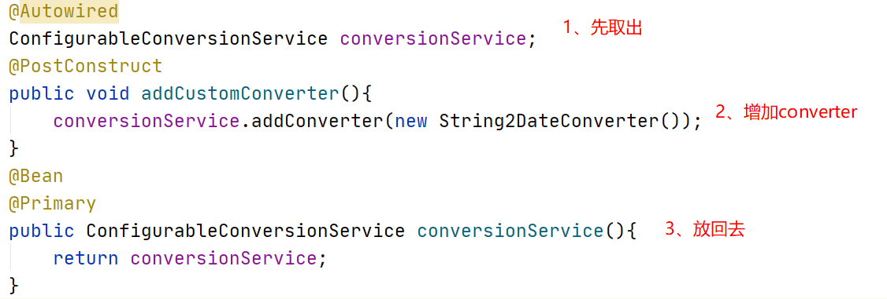
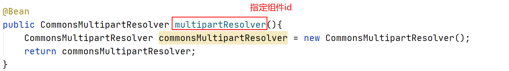
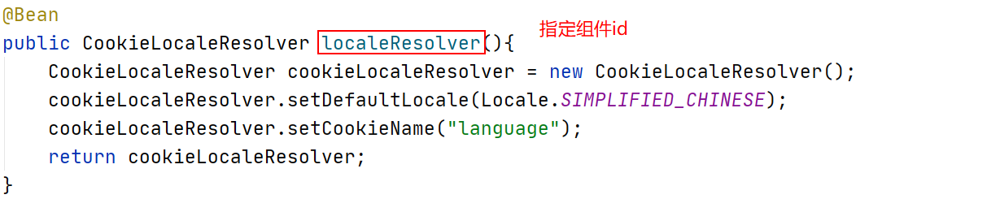
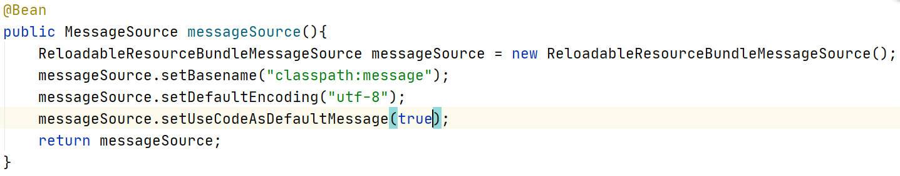
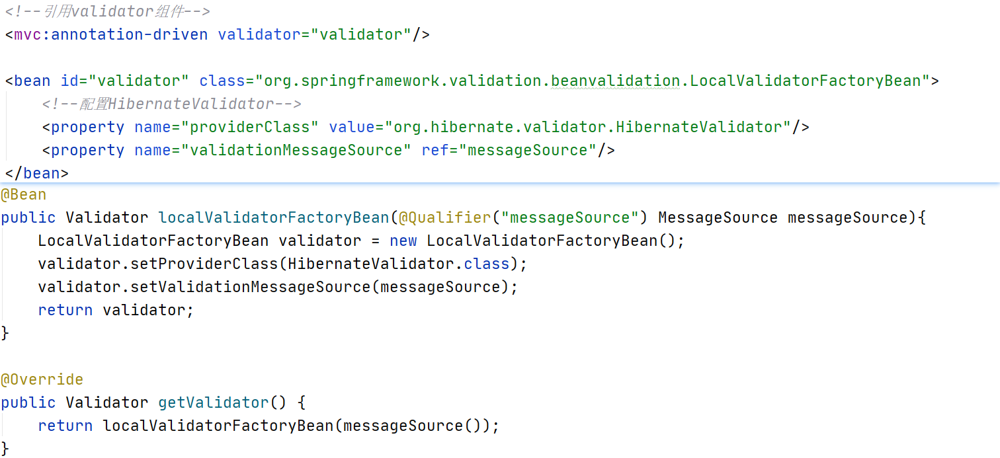
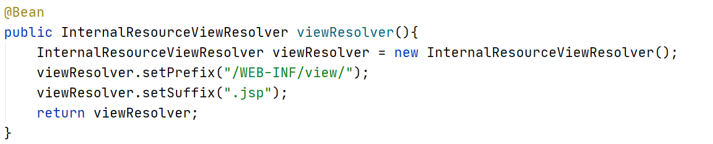
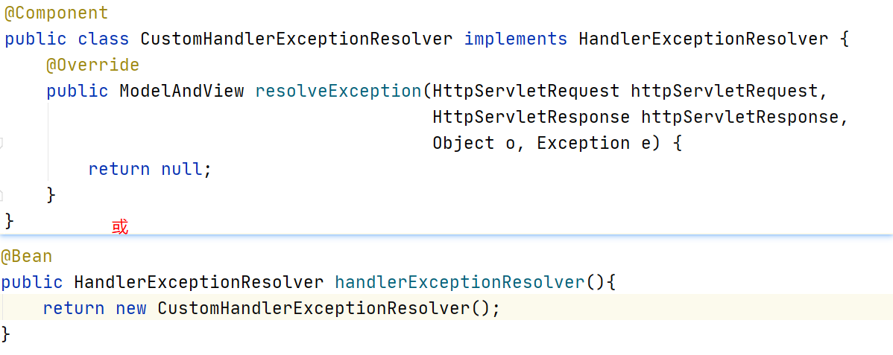

# 目录

## 1、整合Spring与SpringMVC

### 1.1Spring容器和SpringMVC容器的分家



#### 1.1.1在web.xml中加载配置文件

```xml
<!--利用listener在spring-mvc配置文件加载之前加载spring配置文件-->
    <listener>
        <listener-class>org.springframework.web.context.ContextLoaderListener</listener-class>
    </listener>
    <context-param>
        <!--加载Spring配置文件-->
        <param-name>contextConfigLocation</param-name>
        <param-value>classpath:application.xml</param-value>
    </context-param>
    <servlet>
        <servlet-name>dispatcherServlet</servlet-name>
        <servlet-class>org.springframework.web.servlet.DispatcherServlet</servlet-class>
        <init-param>
            <!--加载SpringMVC配置文件-->
            <param-name>contextConfigLocation</param-name>
            <param-value>classpath:application-mvc.xml</param-value>
        </init-param>
    </servlet>
    <servlet-mapping>
        <servlet-name>dispatcherServlet</servlet-name>
        <url-pattern>/</url-pattern>
    </servlet-mapping>
```

#### 1.1.2Spring配置文件

```xml
<context:component-scan base-package="com.cskaoyan">
        <!--排除掉扫描范围-->
        <context:exclude-filter type="annotation" expression="org.springframework.stereotype.Controller"/>
    </context:component-scan>
```

#### 1.1.3SpringMVC配置文件

```xml
<context:component-scan base-package="com.cskaoyan">
<mvc:annotation-driven/>
```

或

```xml
<context:component-scan base-package="com.cskaoyan">
    <context:include-filter type="annotation" expression="org.springframework.stereotype.Controller"/>
</context:component-scan>
<mvc:annotation-driven/>
```
***最后***

```java
@RestController
public class HelloController {

    @RequestMapping("hello")
    public String hello(){
        System.out.println("hello");
        return "hello";
    }

    public HelloController() {
        System.out.println("hello controller init");
    }
}
```

### 1.2使用javaconfig来使用Springmvc

spring容器 → 配置类

springmvc容器 → 配置类

是分开的

web.xml → 启动类

application.xml → 配置类

application-mvc.xml → 配置类

#### 1.2.1替代web.xml的启动类

```java
/**
 * 用来替代web.xml
 * AACDSI 啊啊吃到si
 */
public class ApplicationInitializer extends AbstractAnnotationConfigDispatcherServletInitializer {
    /**
     * 加载Spring的启动类
     */
    @Override
    protected Class<?>[] getRootConfigClasses() {
        return new Class[]{SpringConfiguration.class};
    }
    /**
     * 加载SpringMvc的启动类
     */
    @Override
    protected Class<?>[] getServletConfigClasses() {
        return new Class[]{WebConfiguration.class};
    }
    /**
     * 配置DispatcherServlet的url-pattern /
     */
    @Override
    protected String[] getServletMappings() {
        return new String[]{"/"};
    }
```

#### 1.2.2SpringMVC配置类

```java
/**
 * 用来替代DispatcherServlet启动的application-mvc.xml
 */
@EnableWebMvc
@ComponentScan(value = "com.cskaoyan.controller",
        includeFilters = @ComponentScan.Filter(type = FilterType.ANNOTATION,value = Controller.class))
public class WebConfiguration {
//增加接口的实现来完成其他功能
//public class WebConfiguration implements WebMvcConfigurer {    
```

#### 1.2.3mvc配置类在spring配置类扫描包范围内

```java
/**
 * 用来替代contextLoaderListener启动的application.xml
 */
@Configuration
@ComponentScan(value = "com.cskaoyan",
        excludeFilters = @ComponentScan.Filter(type = FilterType.ANNOTATION,
                value = {Controller.class, EnableWebMvc.class}))
public class SpringConfiguration {
}
```

### 1.3SpringMVC的组件使用javaconfig怎么使用

#### 1.3.1characterEncodingFilter

web.xml → AACDSI

```java
@Override
    protected Filter[] getServletFilters() {
        CharacterEncodingFilter filter = new CharacterEncodingFilter();
        filter.setForceEncoding(true);
        filter.setEncoding("utf-8");
        return new Filter[]{filter};
}
```

#### 1.3.2mvc:resources静态资源映射

<mvc:resources mapping location/>

```java
    @Override
    public void addResourceHandlers(ResourceHandlerRegistry registry) {
        registry.addResourceHandler("/pic1/**").addResourceLocations("/");//web根目录
        registry.addResourceHandler("/pic2/**").addResourceLocations("classpath:/");//classpath目录
        registry.addResourceHandler("/pic3/**").addResourceLocations("file:d:/spring/");//文件目录
    }
```

#### 1.3.3mvc:interceptors interceptor



#### 1.3.4converter(复杂)

<mvc:annotation-driven conversion-service/>

做一个外科 → 心脏搭桥 → 把心脏取出 搭桥 放回去

1、拿到conversionService

2、增加上我们定义的converter

3、conversionService放回去



#### 1.3.5multipartResolver

<bean id="指定id" class/>



#### 1.3.6localeResolver



#### 1.3.7MessageSource



#### 1.3.8validator

<mvc:annotation-driven validator/>



#### 1.3.9viewResolver



#### 1.3.10HandlerExceptionResolver



# 2、homework

```xml
<dependencies>
        <dependency>
            <groupId>org.springframework</groupId>
            <artifactId>spring-webmvc</artifactId>
            <version>5.2.6.RELEASE</version>
        </dependency>
        <dependency>
            <groupId>javax.servlet</groupId>
            <artifactId>servlet-api</artifactId>
            <version>3.0-alpha-1</version>
            <scope>provided</scope>
        </dependency>
        <dependency>
            <groupId>org.projectlombok</groupId>
            <artifactId>lombok</artifactId>
            <version>1.18.12</version>
        </dependency>
</dependencies>
```

```html
//login.jsp
<%--
  Created by IntelliJ IDEA.
  User: stone
  Date: 2020/7/24
  Time: 9:39
  To change this template use File | Settings | File Templates.
--%>
<%@ page contentType="text/html;charset=UTF-8" language="java" %>
<html>
<head>
    <title>Title</title>
</head>
<body>
<form action="login" method="post">
    用户：<input type="text" name="username"><br>
    密码：<input type="text" name="password"><br>
    <input type="submit">
</form>
</body>
</html>

```

```html
//WEB-INF/view/hello.jsp
<%--
  Created by IntelliJ IDEA.
  User: stone
  Date: 2020/7/24
  Time: 9:52
  To change this template use File | Settings | File Templates.
--%>
<%@ page contentType="text/html;charset=UTF-8" language="java" %>
<html>
<head>
    <title>Title</title>
</head>
<body>
<h1>hello world</h1>
</body>
</html>

```

```html
//WEB-INF/view/index.jsp
<%--
  Created by IntelliJ IDEA.
  User: stone
  Date: 2020/7/24
  Time: 9:38
  To change this template use File | Settings | File Templates.
--%>
<%@ page contentType="text/html;charset=UTF-8" language="java" %>
<html>
<head>
    <title>Title</title>
</head>
<body>
    <h1>登录成功</h1>
</body>
</html>

```

```java
//config/ApplicationInitializer.java

public class ApplicationInitializer extends AbstractAnnotationConfigDispatcherServletInitializer {
    @Override
    protected Class<?>[] getRootConfigClasses() {
        return new Class[]{SpringConfiguration.class};
    }

    @Override
    protected Class<?>[] getServletConfigClasses() {
        return new Class[]{MvcConfiguration.class};
    }

    @Override
    protected String[] getServletMappings() {
        return new String[]{"/"};
    }
}
```

```java
//config/MvcConfiguration.java
@EnableWebMvc
@ComponentScan("com.cskaoyan.controller")
public class MvcConfiguration implements WebMvcConfigurer {

    @Override
    public void addInterceptors(InterceptorRegistry registry) {
        //不是/login/**
        //不是要在interceptor中判断username和password是否正确
        registry.addInterceptor(new LoginInterceptor()).addPathPatterns("/**");
    }
}
```

```java
//config/SpringConfiguration.java
@Configuration
@ComponentScan(value = "com.cskaoyan",
        excludeFilters = @ComponentScan.Filter(type = FilterType.ANNOTATION,value = {Controller.class, EnableWebMvc.class}))
public class SpringConfiguration {
}
```

```java
//controller/UserController.java
@Controller
public class UserController {

    @Autowired
    UserService userService;
    @RequestMapping("login")
    public String login(String username, String password, HttpSession session){
        boolean login = userService.login(username, password);
        if (!login){
            return "/login.jsp";
        }
        //标记登录状态
        session.setAttribute("user",username);
        return "/WEB-INF/view/index.jsp";
    }

    @RequestMapping("hello")
    public String hello(){
        return "/WEB-INF/view/hello.jsp";
    }
}

```

```java
//service/UserService.java
public interface UserService {
    boolean login(String username, String password);
}
```

```java
//service/UserServiceImpl.java
@Service
public class UserServiceImpl implements UserService{
    @Override
    public boolean login(String username, String password) {
        if ("songge".equals(username) && "niupi".equals(password)){
            return true;
        }
        return false;
    }
}
```

```java
//interceptor/LoginInterceptor.java
public class LoginInterceptor implements HandlerInterceptor {
    @Override
    public boolean preHandle(HttpServletRequest request, HttpServletResponse response, Object handler) throws Exception {
        //判断用户是否登录 → 在用户登录成功之后，就在session中放入信息
        String requestURI = request.getRequestURI();
        if (request.getSession().getAttribute("user") != null || requestURI.endsWith("login")){
            return true;
        }
        request.getRequestDispatcher("/login.jsp").forward(request, response);
        return false;
    }
}
```

