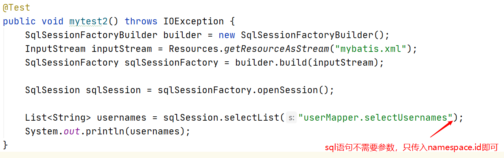
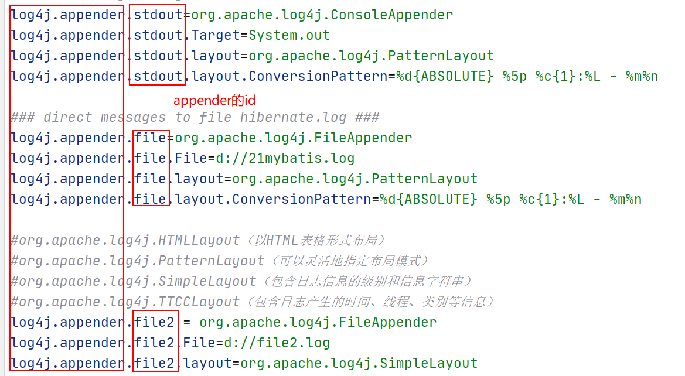
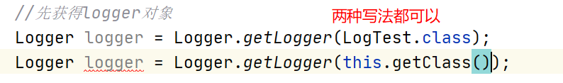
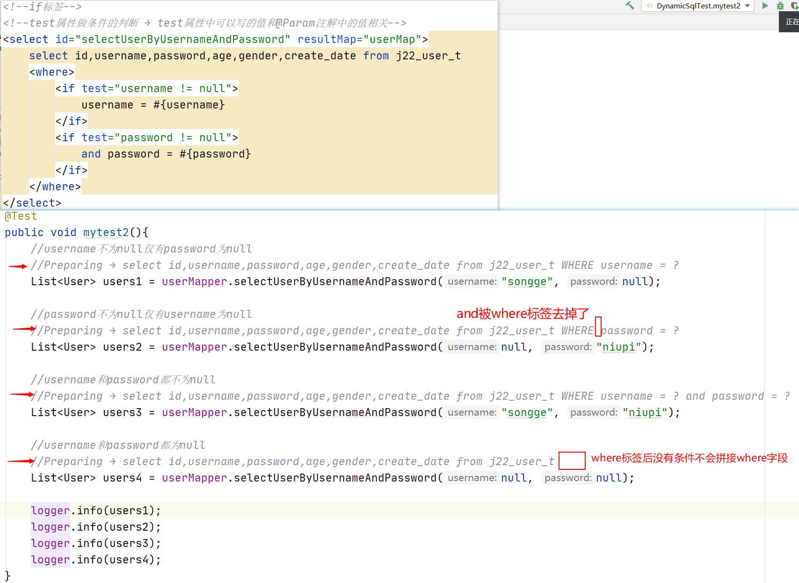
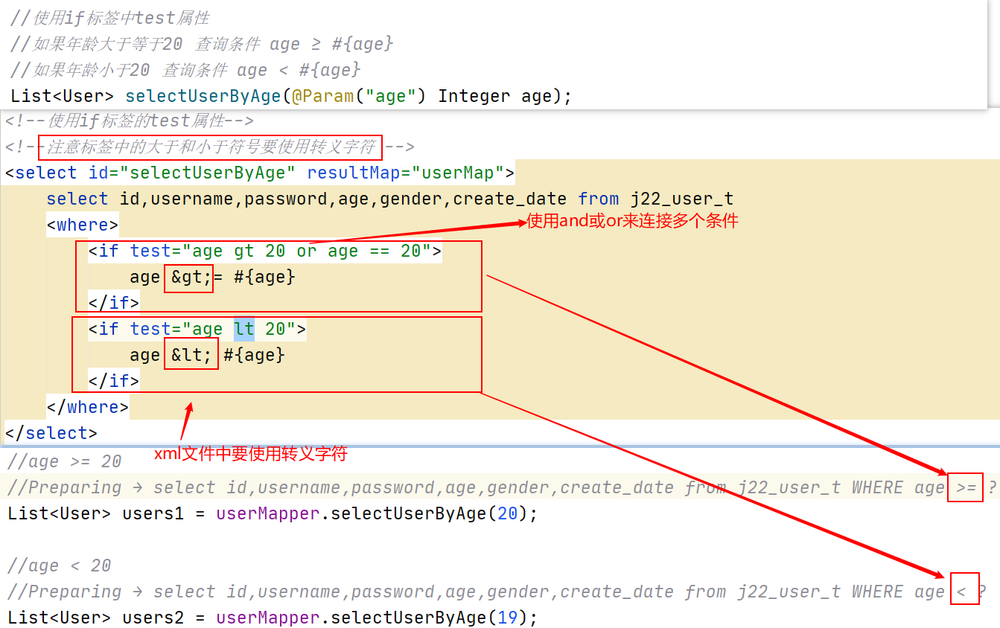
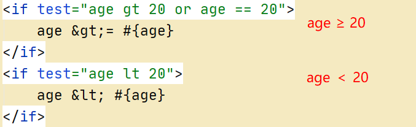
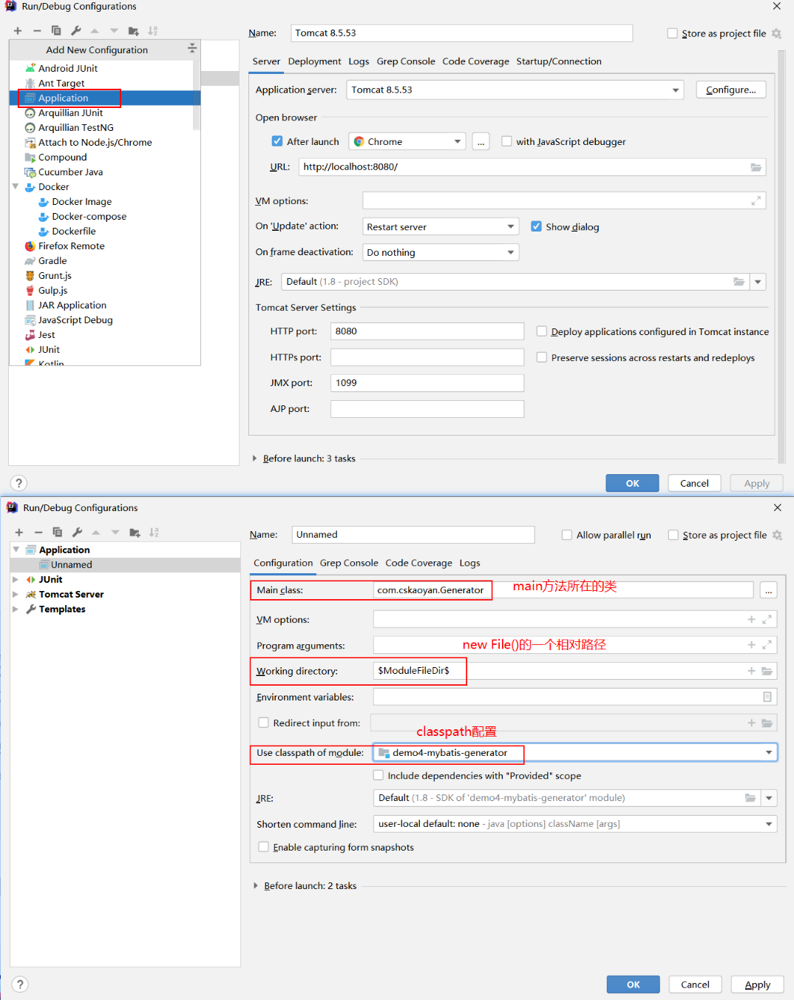
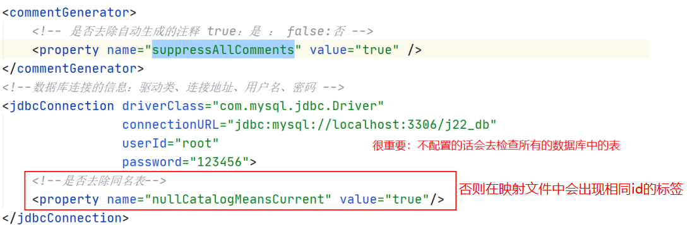
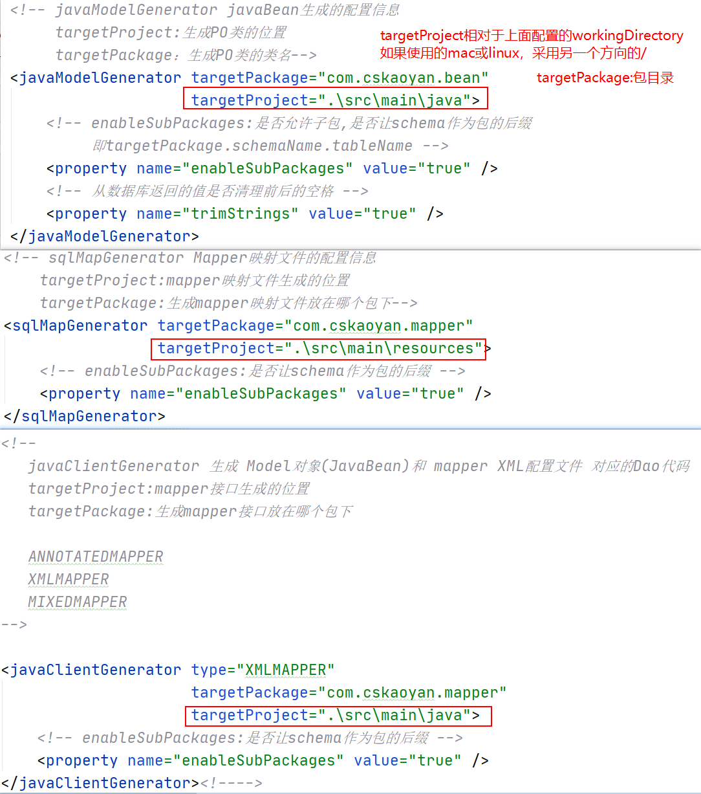

# 6、MyBatis

## 1.mybatis介绍

持久层框架

orm框架 → Object relationship mapping 对象关系映射

对象 → javabean

关系 → 关系表

映射 → 一个javabean对象就可以对应一条关系表中的记录

 

定制Sql：手写sql语句 → 灵活的框架

高级映射：输入映射和输出映射

 

**输入映射**：对象 → 关系表 → 为预编译的sql提供参数

**输出映射**：关系表 → 对象 → 查询结果的封装


 **动态sql**：根据你的参数的不同可以动态的更改执行的sql语句


将sql语句和java代码做一个解耦 → sql集中管理起来 → 映射文件 → 不同模块的sql放到不同的映射文件下


## 2.入门案例1

将sql语句集中管理到映射文件中 → 去调用映射文件中的sql

### 2.1导入依赖

```xml
<dependency>
            <groupId>org.mybatis</groupId>
            <artifactId>mybatis</artifactId>
            <version>3.5.4</version>
        </dependency>

        <dependency>
            <groupId>mysql</groupId>
            <artifactId>mysql-connector-java</artifactId>
            <version>5.1.47</version>
            <scope>runtime</scope>
</dependency>
```

### 2.2引入mybatis的配置文件

加载datasource

加载映射文件 → 映射文件的名字 xxxMapper

```xml
//mybatis.xml
<?xml version="1.0" encoding="UTF-8" ?>
<!DOCTYPE configuration
        PUBLIC "-//mybatis.org//DTD Config 3.0//EN"
        "http://mybatis.org/dtd/mybatis-3-config.dtd">
<configuration>
    <environments default="development">
        <environment id="development">
            <transactionManager type="JDBC"/>
            <dataSource type="POOLED">
                <property name="driver" value="com.mysql.jdbc.Driver"/>
                <!--&要使用转义字符-->
                <property name="url" value="jdbc:mysql://localhost:3306/j22_db?useUnicode=true&amp;characterEncoding=utf-8"/>
                <property name="username" value="root"/>
                <property name="password" value="123456"/>
            </dataSource>
        </environment>
    </environments>
    <mappers>
        <!--resource对应的就是classpath-->
        <mapper resource="mapper/UserMapper.xml"/>
    </mappers>
</configuration>
```

### 2.3使用映射文件中的sql语句

#### 2.3.1获得SqlSession


#### 2.3.2获得sqlID


#### 2.3.3sqlsession执行对应sql


#### 2.3.4映射文件中的sql语句写法


```xml
<?xml version="1.0" encoding="UTF-8" ?>
<!DOCTYPE mapper
        PUBLIC "-//mybatis.org//DTD Mapper 3.0//EN"
        "http://mybatis.org/dtd/mybatis-3-mapper.dtd">

</mapper>
```

#### 2.3.5最终


### 2.4通过代码的提取


### 2.5其他的crud操作

sqlSession来调用对应的sql

#### 2.5.1查询list

sqlSession.selectList


业务场景：将所有的username都查询出来




#### 2.5.2新增

sqlSession.insert

#### 2.5.3修改

sqlSession.update

#### 2.5.4删除

sqlSesseion.delete


### 2.6小结

使用sqlSession的方法，找到对应要执行的sql语句 → namespace.id

1、做查询一定要写resultType，而增删改不需要也写不了

2、调用sqlSession的方法的两个参数

字符串：namespace.id

object：为sql语句提供参数，决定了sql语句中#{}中的值要怎样写

基本类型、String、包装类：#{}中任意写

javabean或map：#{}中写javabean的成员变量名或map的key


## 3.入门案例2

mybatis配置文件相关

入门案例1中只做了 datasource和mappers的配置（必需的配置）→ 青春版（丐版）

### 3.1properties(参数)

给mybatis中的配置项提供参数 → mybatis.xml

#### 3.1.1单项的配置


#### 3.1.2批量的配置（引入一个properties配置）


### 3.2setting


### 3.3typeAliases（类型别名）

映射文件中 → resultType 或 type

 

张松 → 松哥

李艮隶 → 小白龙 → 隶哥

张帅 → 帅哥

lanzhao→ 钊哥

 

有个类 com.cskaoyan.bean.User → user

有个类 com.cskaoyan.bean.Order → order

 根据id查询user信息


#### 3.3.1逐个配置

mybatis.xml


#### 3.3.2批量配置


#### 3.3.3mybatis也提供了一些别名

基本类型、包装类、java.lang目录下的类


### 3.4typehandlers

类型转换：输入映射和输出映射过程中

暂时讲不了：

### 3.5mappers

#### 3.5.1逐项配置

##### 3.5.1.1resource


##### 3.5.1.2url


##### 3.5.1.3class（非常重要）


#### 3.5.2批量配置package(非常重要)

批量配置是和上面的class这种配置是相关

配置的是接口所在的包目录 → 加载该包目录下的全部接口


```xml
<?xml version="1.0" encoding="UTF-8" ?>
<!DOCTYPE configuration
        PUBLIC "-//mybatis.org//DTD Config 3.0//EN"
        "http://mybatis.org/dtd/mybatis-3-config.dtd">
<configuration>
    <properties resource="db.properties">
        <!--name方便配置文件引用值-->
        <!--<property name="driver" value="com.mysql.jdbc.Driver"/>
        <property name="jdbcUrl" value="jdbc:mysql://localhost:3306/j22_db"/>-->
    </properties>
    <!--<settings>
        <setting name="" value=""/>
    </settings>-->
    <typeAliases>
        <!--type写全类名 alias写的就是别名-->
        <!--<typeAlias type="com.cskaoyan.bean.User" alias="userz"/>-->
        <!--name写包名 → javabean所在的包 → 这个包下所有的javabean都给配置了别名 → 规律：类名的纯小写-->
        <package name="com.cskaoyan.bean"/>
    </typeAliases>
    <environments default="development">
        <environment id="development">
            <transactionManager type="JDBC"/>
            <dataSource type="POOLED">
                <property name="driver" value="${db.driver}"/>
                <property name="url" value="${db.jdbcUrl}"/>
                <property name="username" value="${db.username}"/>
                <property name="password" value="${db.password}"/>
            </dataSource>
        </environment>
    </environments>
    <mappers>
        <!--resource属性：加载classpath下的映射文件-->
        <!--<mapper resource="mapper/UserMapper.xml"/>-->
        <!--url属性：加载的是文件路径下的映射文件-->
        <mapper url="file:///D:\WorkSpace\j22_workspace\codes\day11-mybatis1\demo2-configuration\src\main\resources\mapper\UserMapper.xml"/>
        <!--class属性：-->
    </mappers>
</configuration>
```


## 4.Log4j

mybatis本身支持了log4j，可以直接使用

### 4.1开始使用

#### 4.1.1导包


#### 4.1.2复制配制文件

直接复制到classpath目录

### 4.2控制台输出一些日志

直接复制到classpath目录

mybatis代码中就是写了这些输出内容的代码 → log4j依赖和配置引进 → 输出内容的代码就执行到了 → 输出出来了

主要看这些内容


### 4.3日志log4j配置文件的介绍

#### 4.3.1appender

#### 4.3.2输出appender有哪些和级别


#### 4.3.3layout

含义是日志输出内容的格式


#### 4.3.4pattern-layout中的格式


%d：日期信息

%d{ABSOLUTE}：ABSOLUTE代表的是日期的格式

%5p：p日志级别  5代表占用5字符

%c: category类 → 输出日志的代码是属于哪一个类的

%c{1}: 数字代表类输出几个层级,从后先前数的

%L：输入日志的代码的行号

%m：message 日志中输出的消息

%n: 换行

### 4.4日志级别

debug → info → warn → error → fatal

由低到高输出的内容量是递减：输出当前级别以及更高级别的内容

debug → 都会输出debug → info → warn → error → fatal

info → 输出info → warn → error → fatal


### 4.5日志输出



## 5.高级映射

预编译的sql语句

### 5.1输入映射（重要）

为预编译的sql语句提供参数 → 映射文件中的sql语句要执行，都是有一个预编译的过程

 

接口和方法 → namespace和id

在接口的方法中提供不同的参数 → 对应的标签中 #{}中的值如何来写

接口中方法的参数写法不同 → #{}的写法对应不同

#### 5.1.1未使用注解

##### 5.1.1.1单个参数

单个参数其实就是我们在入门案例1中 传入的object使用情况类似

###### 5.1.1.1.1基本类型、包装类、java.lang

比如 int、Double、Float、String

-> #{}中任意写


###### 5.1.1.1.2javabean或map

1）javabean


2）map


##### 5.1.1.2多个参数

param：下标从1开始 → 如果是第一个参数 param1

arg：下标从0 → 如果是第一个参数 arg0

基本类型、包装类、java.lang：param或arg

javabean或map：要使用param或arg，然后在加上上javabean的成员变量名或map的key


#### 5.1.2使用注解

@Param → 方法的形参上

\#{} → @Param注解中的value

@Param中你写了什么，你就用什么 → 写啥用啥

 

**不管你有几个参数，不管参数类型是啥 → 写啥用啥**

关注的是#{}中的值的写法


```java
/**
 * 使用注解
 */
public interface UserAnnotationMapper {
    /*
     * 有注解单个参数
     * 基本类型、包装类、字符串
     * */
    String selectUsernameById(@Param("id") int id);
    String selectUsernameByAge(@Param("age") Integer age);
    String selectPasswordByUsername(@Param("username") String username);


    /*
     * 有注解单个参数
     * javabean和map对象
     * */
    int insertUser(@Param("user") User user);
    int updatePasswordByUsername(@Param("map") Map map);


    /*
     * 多个参数有注解： 基本类型、包装类、字符串、javabean、map对象
     * 由javabean提供password user.setPassword("xxxx")
     * 由map对象提供gender map.put("gender","xxxx")
     * */
    int insertUserMultiParam(@Param("id") int id,
                             @Param("username") String username,
                             @Param("user") User user,
                             @Param("age") Integer age,
                             @Param("map") Map map);
}
```

```xml
<mapper namespace="com.cskaoyan.mapper.UserAnnotationMapper">
    <!--单个参数使用注解-->
    <!--基本类型-->
    <select id="selectUsernameById" resultType="string">
        select username from j22_user_t where id = #{id}
    </select>
    <!--包装类-->
    <select id="selectUsernameByAge" resultType="java.lang.String">
        select username from j22_user_t where age = #{age}
    </select>
    <!--字符串-->
    <select id="selectPasswordByUsername" resultType="java.lang.String">
        select password from j22_user_t where username = #{username}
    </select>

    <!--*************************************-->
    <!--单个参数使用注解-->
    <!--javabean类型 #{}使用javabean的成员变量名 → get方法-->
    <insert id="insertUser">
        insert into j22_user_t (id,username,password,age,gender) values
        (#{user.id},#{user.username},#{user.password},#{user.age},#{user.gender})
    </insert>
    <!--map对象 #{}使用的是map的key-->
    <update id="updatePasswordByUsername">
        update j22_user_t set password = #{map.password} where username = #{map.username}
    </update>


    <!--**************************************-->
    <!--多个参数使用注解-->
    <insert id="insertUserMultiParam">
        insert into j22_user_t (id,username,password,age,gender)
        values
        (#{id},#{username},#{user.password},#{age},#{map.gender})
    </insert>
</mapper>
```


### 5.2输出映射(重要)

关注的是查询结果的封装 → 接口中方法的返回值

#### 5.2.1基本类型、包装类、java.lang

##### 5.2.1.1单个参数

##### 5.2.1.2多个参数


#### 5.2.2javabean

查询user对象

查询结果的列名和javabean的成员变量名（set方法）对应


##### 5.2.2.1单个参数

##### 5.2.2.2多个参数


注意：

接口中定义了方法 映射文件中就一定要有与之对应的sql语句

 

映射文件中的标签，接口中的方法不一定要有

 

接口中的方法不能重载：接口中不允许存在同名的方法 → 映射文件中的标签id的唯一性

#### 5.2.3resultMap

之前主要使用的是resultType → 查询结果的列名和javabean的成员变量名一致

resultMap → 不一定一致，但是呢要有映射关系

仍然是封装javabean


***疑问？***

使用resultType好好的，为什么使用resultMap？

1、查询结果的列名和javabean的成员变量名要求不一定一致了

2、resultMap写在外围，可以方便select标签进行引用；resultMap类似全局变量

3、typeHandler，多表映射都需要使用到resultMap

#### 5.2.4动态sql标签

##### 5.2.4.1where


###### 5.2.4.1.1去掉where标签直接跟着关系词(and 和 or)

```xml
 <!--if标签-->
    <!--test属性做条件的判断 → test属性中可以写的值和@Param注解中的值相关-->
    <select id="selectUserByUsernameAndPassword" resultMap="userMap">
        select id,username,password,age,gender,create_date from j22_user_t
        <where>
            <if test="username != null">
                username = #{username}
            </if>
            <if test="password != null">
                and password = #{password}
            </if>
        </where>
    </select>
```


###### 5.2.4.1.2where标签无条件下不会拼接where字段


##### 5.2.4.2if

做的判断：提供了一个条件

如果满足条件：拼接if标签中的语句

如果不满足：则不会拼接



###### 4.2.4.2.1test属性中的判断

大于：gt

小于：lt

连接条件：and或者or

等于：==

不等于：!= 

大于等于：比如判断age≥20 → age gt 20 or age == 20

小于等于：比如判断age≤20 → age lt 20 or age == 20

字符串比较：字符串用 ‘’ ，比如判断username为songge → username == ‘songge’

字符串长度：’songge’.length ,如果要判断username的长度 → username.length

 

如果年龄大于等于20 查询条件 age ≥ #{age}

如果年龄小于20 查询条件 age < #{age}




###### 4.2.4.2.2if标签有else吗

if标签是没有else，如果你想写else那么你就写两个if标签，test属性中的条件是相反的



##### 4.2.4.3choose-when-otherwise

做的就是if-else 

when代表的是if

otherwise代表else

when标签中也是去写test属性 → 用法和if标签中的test一致

重写一下if标签中关于年龄判断的案例

→ when标签和otherwise标签要作为choose标签的子标签


##### 4.2.4.4trim

去除

prifixOverrides：如果最前面包含某个词 → 去除掉

suffixOverrides：如果最后面包含某个词 → 去除掉

补充

prefix：在trim标签最前面补充

suffix：在trim标签最后面补充

 

updateUser → update 传入的user对象的全部字段（不管是否为null全部更新）

updateSelectiveUser → update传入的user对象不为null的字段

###### 4.2.4.4.1引出trim标签的使用


###### 4.2.4.4.2trim标签去除内容

设置条件！=null


###### 4.2.4.4.3其他属性的使用


##### 4.2.4.5set

更新语句 update标签中使用

更新语句的部分放到set标签 → 功能类似于 

<trim prefix="set" suffixOverrides=","> 


##### 4.2.4.6sql include

做的事情是 

sql标签：定义sql  → 定义了映射文件中的全局变量

include标签：引用sql → 引用这个全局变量


###### 4.2.4.6.1将查询结果的列写入到sql片段中


###### 4.2.4.6.2通用的条件写入到sql片段中


##### 4.2.4.7selectKey

在执行insert语句之前或之后额外的执行一次查询

 user这张表id是自增，执行insert（user）时，不定义id → 

执行完之后，user对象上我们又想要获得自增的id

###### 4.2.4.7.1order=after


###### 4.2.4.7.2order=before

password利用uuid来进行生成 → 构造user时就不设置password → 利用selectKey来设置


##### 4.2.4.8foreach

遍历

###### 4.2.4.8.1无注解数组


###### 4.2.4.8.2无注解list

区别在于collection中的写法是不同的


###### 4.2.4.8.3@Param注解

不管你传入的是数组还是list → 写啥用啥


###### 4.2.4.8.4另一个使用场景insertList

插入多条数据


##### 4.2.4.9useGenerateKeys keyProperty

获得自增的主键

insert标签中使用属性 → useGenerateKeys keyProperty

###### 4.2.4.9.1单条数据获得自增主键


###### 4.2.4.9.2多条数据获得自增主键


### 5.3多表映射

一对一、一对多、多对多查询

javabean构造关系

数据库表构造关系

查询结果的封装

 

一对一：User UserDetail

一对多：User Order

多对多：Student Course → 双向的一对多

#### 5.3.1一对一

##### 5.3.1.1javabean之间关系


##### 5.3.1.2数据库表之间关系


##### 5.3.1.3查询

###### 5.3.1.3.1分次查询


如果查询多条记录：


###### 5.3.1.3.2连接查询(通常使用左连接)

左连接能够保证左表信息的查询 → 保证左一的javabean的查询结果的封装


###### 5.3.1.3.3小结

一对一：

联系：都使用association标签 → 都使用了property属性

区别：

分次查询：column和select属性

连接查询：javaType属性


#### 5.3.2一对多

##### 5.3.2.1javabean之间关系


##### 5.3.2.2数据库表之间关系

在“多”的表中创建“一”表的唯一标识（通常主键）


##### 5.3.2.3查询

###### 5.3.2.3.1分次查询


###### 5.3.2.3.2连接查询


#### 5.3.3多对多

本质上就是双向的一对多 → 互为一对多

##### 5.3.3.1javabean之间的关系


##### 5.3.3.2数据库表之间关系

中间表


##### 5.3.3.3查询

###### 5.3.3.3.1分次查询


2）student对course的一对多


3）course对student的一对多


###### 5.3.3.3.2连接查询


1）student对course的一对多


2）course对student的一对多


## 6.settings（了解）

### 6.1缓存

查询：执行完某个查询 → 执行相同的查询 → 使用之前查询过的结果

#### 6.1.1一级缓存（默认开启）

sqlSession级别

##### 6.1.1.1同一个sqlSession生成的同一个Mapper执行相同的查询


##### 6.1.1.2同一个Session生成的不同mapper


##### 6.1.1.3一级缓存何时失效

sqlSession 执行commit会失效


#### 6.1.2二级缓存(需要条件)

namespace → 同一个接口下的方法

1、settings → cacheEnabled=true（mybatis.xml)

2、javabean需要序列化 implements Serializable

映射文件中需要增加<cache/>(Mapper.xml)


##### 6.1.2.1使用


### 6.2懒加载

单例 → 讲过懒加载 

mybatis → 多表映射

user userDetail

user orders

懒加载针对的是分次查询： 当要去获得右一或右多的时候才去执行第二次查询

 

懒加载默认没有开启 → 如何开启懒加载 → settings lazyLoadingEnabled=true


→ lazyLoadingEnabled = true → 分次查询就已经是懒加载了


想要立即加载：association或collection标签中，增加fetchType=“eager”


#### 6.2.1注意

执行对象打印时会使用到toString方法，如果你对toString重写了，就会获取第二次查询的对象

debug时也会使用到toString


## 7.typehandler

类型转换器

```xml
        <dependency>
            <groupId>com.fasterxml.jackson.core</groupId>
            <artifactId>jackson-databind</artifactId>
            <version>2.11.0</version>
        </dependency>
```


### 7.1Jackson提供的api

```java
ObjectMapper objectMapper = new ObjectMapper();
```

#### 7.1.1字符串转Javabean


#### 7.1.2Javabean转换为字符串


### 7.2typehandler使用

#### 7.2.1注册typehandler

```xml
<typeHandlers>
        <!--单个typeHandler的注册-->
        <typeHandler handler="com.cskaoyan.typehandler.UserDetailTypehandler"/>
        <!--批量注册-->
        <package name="com.cskaoyan.typehandler"/>
</typeHandlers>
```

#### 7.2.2自定义typehandler

##### 7.2.2.1类上


##### 7.2.2.2输入映射对应的方法


##### 7.2.2.3输出映射对应的方法


## 8.generator

逆向工程

生成数据库表 对应的

1、javabean

2、接口

3、映射文件

### 8.1导包

```xml
        <dependency>
            <groupId>org.mybatis.generator</groupId>
            <artifactId>mybatis-generator-core</artifactId>
            <version>1.4.0</version>
        </dependency>
        <dependency>
            <groupId>mysql</groupId>
            <artifactId>mysql-connector-java</artifactId>
            <version>5.1.47</version>
        </dependency>
```

### 8.2main方法

不需要自己写 → 复制进来




### 8.3配置文件






### 8.4example

辅助类 → where条件 数据库表中的任意条件


### 8.5Selective

<if标签


### 8.6byPrimaryKey

主键


### 8.7如何使用example


### 8.8注意事项

1、不要已有的项目上使用逆向工程，单独创建一个项目使用 → 会覆盖文件

2、javabean、接口、映射文件文件的package配置和你已有的项目的包目录 

3、逆向工程生成过文件 → 重新生成时 删除掉已有的文件 → 映射文件中会存在相同id的表 → 因为做的是增量更新


## *Appendix

### *.1mybatis插件

配置了别名之后按住ctrl可以直接进入别名对应的类中


https://plugins.jetbrains.com/plugin/


