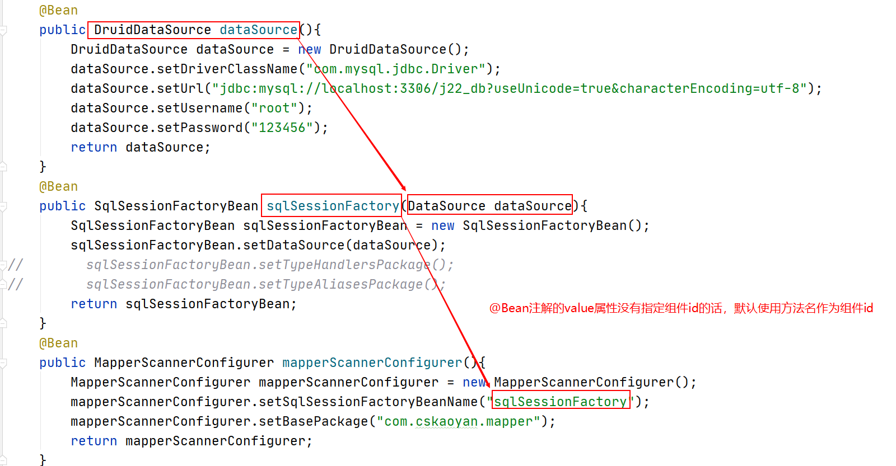

# 7、SSM整合

Spring SpringMVC Mybatis

 在Spring的环境下注册组件：


SqlSessionFactory

MapperScannerConfigurer

 

mapper接口对应的对象 通过Spring管理起来

### 7.1依赖

```xml
<dependencies>
        <dependency>
            <groupId>org.springframework</groupId>
            <artifactId>spring-webmvc</artifactId>
            <version>5.2.6.RELEASE</version>
        </dependency>
        <dependency>
            <groupId>javax.servlet</groupId>
            <artifactId>servlet-api</artifactId>
            <version>3.0-alpha-1</version>
            <scope>provided</scope>
        </dependency>
        <dependency>
            <groupId>com.fasterxml.jackson.core</groupId>
            <artifactId>jackson-databind</artifactId>
            <version>2.11.0</version>
        </dependency>
        <!--mybatis整合spring的依赖-->
        <dependency>
            <groupId>org.mybatis</groupId>
            <artifactId>mybatis</artifactId>
            <version>3.5.4</version>
        </dependency>
        <dependency>
            <groupId>org.mybatis</groupId>
            <artifactId>mybatis-spring</artifactId>
            <version>2.0.4</version>
        </dependency>
        <dependency>
            <groupId>mysql</groupId>
            <artifactId>mysql-connector-java</artifactId>
            <version>5.1.47</version>
            <scope>runtime</scope>
        </dependency>
        <dependency>
            <groupId>com.alibaba</groupId>
            <artifactId>druid</artifactId>
            <version>1.1.22</version>
        </dependency>
        <dependency>
            <groupId>org.springframework</groupId>
            <artifactId>spring-jdbc</artifactId>
            <version>5.2.6.RELEASE</version>
        </dependency>
        <dependency>
            <groupId>org.projectlombok</groupId>
            <artifactId>lombok</artifactId>
            <version>1.18.12</version>
        </dependency>
    </dependencies>
```

### 7.2xml配置

#### 7.2.1基本配置

> <param-value>classpath:application.xml</param-value>Spring
>
> <param-value>classpath:application-mvc.xml</param-value>SpringMVC

```xml
<?xml version="1.0" encoding="UTF-8"?>
<web-app xmlns="http://xmlns.jcp.org/xml/ns/javaee"
         xmlns:xsi="http://www.w3.org/2001/XMLSchema-instance"
         xsi:schemaLocation="http://xmlns.jcp.org/xml/ns/javaee http://xmlns.jcp.org/xml/ns/javaee/web-app_4_0.xsd"
         version="4.0">
    <listener>
        <listener-class>org.springframework.web.context.ContextLoaderListener</listener-class>
    </listener>
    <context-param>
        <param-name>contextConfigLocation</param-name>
        <param-value>classpath:application.xml</param-value>
    </context-param>
    <servlet>
        <servlet-name>dispatcherServlet</servlet-name>
        <servlet-class>org.springframework.web.servlet.DispatcherServlet</servlet-class>
        <init-param>
            <param-name>contextConfigLocation</param-name>
            <param-value>classpath:application-mvc.xml</param-value>
        </init-param>
    </servlet>
    <servlet-mapping>
        <servlet-name>dispatcherServlet</servlet-name>
        <url-pattern>/</url-pattern>
    </servlet-mapping>
</web-app>
```

#### 7.2.2mybatis组件注册

> application.xml

```xml
<?xml version="1.0" encoding="UTF-8"?>
<beans xmlns="http://www.springframework.org/schema/beans"
       xmlns:xsi="http://www.w3.org/2001/XMLSchema-instance"
       xmlns:context="http://www.springframework.org/schema/context"
       xmlns:aop="http://www.springframework.org/schema/aop"
       xsi:schemaLocation="
        http://www.springframework.org/schema/beans https://www.springframework.org/schema/beans/spring-beans.xsd
        http://www.springframework.org/schema/context https://www.springframework.org/schema/context/spring-context.xsd
        http://www.springframework.org/schema/aop https://www.springframework.org/schema/aop/spring-aop.xsd">
    <context:component-scan base-package="com.cskaoyan">
        <!--排除掉-->
        <context:exclude-filter type="annotation" expression="org.springframework.stereotype.Controller"/>
    </context:component-scan>

    <!--druid-->
    <bean id="datasource" class="com.alibaba.druid.pool.DruidDataSource">
        <property name="driverClassName" value="com.mysql.jdbc.Driver"/>
        <property name="url" value="jdbc:mysql://localhost:3306/j22_db?useUnicode=true&amp;characterEncoding=utf-8"/>
        <property name="username" value="root"/>
        <property name="password" value="123456"/>
    </bean>
    <!--SqlSessionFactory-->
    <bean id="sqlSessionFactory" class="org.mybatis.spring.SqlSessionFactoryBean">
        <property name="dataSource" ref="datasource"/>
        <!--别名-->
        <property name="typeAliasesPackage" value="com.cskaoyan.bean"/>
        <!--typehandler-->
        <property name="typeHandlersPackage" value="com.cskaoyan.typehandler"/>
        <!--引进额外的配置-->
        <property name="configLocation" value="classpath:mybatis.xml"/>
    </bean>
    <!--MapperScannerConfigurer-->
    <bean class="org.mybatis.spring.mapper.MapperScannerConfigurer">
        <property name="sqlSessionFactoryBeanName" value="sqlSessionFactory"/>
        <property name="basePackage" value="com.cskaoyan.mapper"/>
    </bean>


</beans>
```

#### 7.2.3使用

```java
@Service
public class UserServiceImpl implements UserService{

    //容器中的组件可以从容器中取出mapper
    @Autowired
    UserMapper userMapper;
    @Override
    public User queryUser(Integer id) {
        return userMapper.selectUserById(id);
    }
}
```

### 7.3JavaConfig

#### 7.3.1基本配置

##### 7.3.1.1启动类

```java
public class ApplicationInitializer extends AbstractAnnotationConfigDispatcherServletInitializer {
    @Override
    protected Class<?>[] getRootConfigClasses() {
        return new Class[]{ApplicationConfiguration.class};
    }

    @Override
    protected Class<?>[] getServletConfigClasses() {
        return new Class[]{WebConfiguration.class};
    }

    @Override
    protected String[] getServletMappings() {
        return new String[]{"/"};
    }
}

```

##### 7.3.1.2Spring配置类

```java
@Configuration
@ComponentScan(value = "com.cskaoyan",
        excludeFilters = @ComponentScan.Filter(type = FilterType.ANNOTATION,
                value = {Controller.class, EnableWebMvc.class}))
public class ApplicationConfiguration {}
```

##### 7.3.1.3SpringMVC配置类

```java
@EnableWebMvc
@ComponentScan("com.cskaoyan.controller")
public class WebConfiguration implements WebMvcConfigurer {
}
```

#### 7.3.2mybatis组件注册

```java
@Configuration
@ComponentScan(value = "com.cskaoyan",
        excludeFilters = @ComponentScan.Filter(type = FilterType.ANNOTATION,
                value = {Controller.class, EnableWebMvc.class}))
public class ApplicationConfiguration {

    @Bean
    public DruidDataSource dataSource(){
        DruidDataSource dataSource = new DruidDataSource();
        dataSource.setDriverClassName("com.mysql.jdbc.Driver");
        dataSource.setUrl("jdbc:mysql://localhost:3306/j22_db?useUnicode=true&characterEncoding=utf-8");
        dataSource.setUsername("root");
        dataSource.setPassword("123456");
        return dataSource;
    }
    @Bean
    public SqlSessionFactoryBean sqlSessionFactory(DataSource dataSource){
        SqlSessionFactoryBean sqlSessionFactoryBean = new SqlSessionFactoryBean();
        sqlSessionFactoryBean.setDataSource(dataSource);
//        sqlSessionFactoryBean.setTypeHandlersPackage();
//        sqlSessionFactoryBean.setTypeAliasesPackage();
        return sqlSessionFactoryBean;
    }
    @Bean
    public MapperScannerConfigurer mapperScannerConfigurer(){
        MapperScannerConfigurer mapperScannerConfigurer = new MapperScannerConfigurer();
        mapperScannerConfigurer.setSqlSessionFactoryBeanName("sqlSessionFactory");
        mapperScannerConfigurer.setBasePackage("com.cskaoyan.mapper");
        return mapperScannerConfigurer;
    }
}
```



### 7.4Controller

```java
@RestController
public class UserController {
    @Autowired
    UserService userService;
    @RequestMapping("user/query/{id}")
    public BaseRespVo queryUserById(@PathVariable("id") Integer id){
        User user = userService.queryUser(id);
        return BaseRespVo.ok(user);
    }
}
```

### 7.5Mapper

```java
//接口要在MapperScannerConfigurer的扫描包范围内
public interface UserMapper {
    User selectUserById(@Param("id") Integer id);
}
```

### 7.6Service

```java
public interface UserService {
    User queryUser(Integer id);
}
```

```java
@Service
public class UserServiceImpl implements UserService{

    @Autowired
    UserMapper userMapper;
    @Override
    public User queryUser(Integer id) {
        return userMapper.selectUserById(id);
    }
}
```

```xml
<?xml version="1.0" encoding="UTF-8" ?>
<!DOCTYPE mapper
        PUBLIC "-//mybatis.org//DTD Mapper 3.0//EN"
        "http://mybatis.org/dtd/mybatis-3-mapper.dtd">
<!--namespace就是该映射文件的唯一id，映射文件的namespace(命名空间)不能重复-->
<mapper namespace="com.cskaoyan.mapper.UserMapper">
    <resultMap id="userMap" type="com.cskaoyan.bean.User">
        <result column="id" property="id"/>
        <result column="username" property="username"/>
        <result column="password" property="password"/>
        <result column="age" property="age"/>
        <result column="gender" property="gender"/>
        <result column="create_date" property="createDate"/>

    </resultMap>
    <select id="selectUserById" resultMap="userMap">
        select id,username,password,age,gender,create_date from j22_user_t where id = #{id}
    </select>
</mapper>
```

